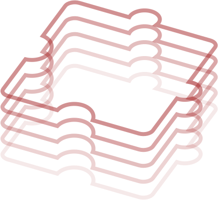

<br>

<div align="right">


</div>

<br><br>

 **کنار دیوار** بستری برای افزودن اطلاعات و خدمات به دیوار است.
 با ارائهٔ خدمات خود در **کنار دیوار**، به کاربران دیوار کمک کنید تجربهٔ خرید و فروش ساده‌تر، مطمئن‌تر و دلنشین‌تری را تجربه کنند.
در **کنار دیوار** می‌توانید:
- به آگهی‌گذاران کمک کنید اطلاعات تکمیلی در آگهی‌های خود درج کنند.
- با همکاری آگهی‌گذاران خدمات تکمیلی روی آگهی‌ها ارائه دهید.
- با ارائهٔ خدمات در چت، تعامل کاربران را در راستای معاملهٔ سریع‌تر و مطمئن‌تر تسهیل کنید.
---

🚀 برای شروع کار در **کنار دیوار**، در [پنل کنار دیوار][پنل کنار] ثبت‌نام کنید. 


---

<br>
<div dir="rtl">
 🚧 ‌‌APIهای آزمایشی 🚧 
 
</div>

>
> برخی از APIهای **کنار دیوار** در حال حاضر در مرحلهٔ آزمایشی هستند. در این مرحله ممکن است قواعد، سیاست‌ها و ابزارهای آزمایشی در بازه‌های زمانی کوتاه تغییر کنند. این تغییرات از طریق ایمیلی که در پنل کنار ثبت کرده‌اید به اطلاع شما می‌رسد. در صورت استفاده از این API ها، آمادگی به روزرسانی و تغییر در بازه‌های ۲ هفته‌ای را داشته باشید. آدرس APIهای آزمایشی در مستندات به جای نسخه‌بندی (مثلاً v2) با experimental شروع می‌شود.

<br>

 به دلیل سرعت تغییرات، ممکن است در بازه‌های زمانی خاصی اطلاعات ارائه شده در مورد این APIها در این مخزن نیز ناقص یا نیازمند بروزرسانی باشند.

<br>

> ☎️ ***تماس با ما***
>
> - پاسخ سوالتان را در این مستندات پیدا نکرده‌اید؟ سوالات خود را [اینجا][ایشوی جدید] بپرسید.
> - برای افزونه‌ی خود درخواست تغییر یا انتشار دارید؟ در توسعه‌ی افزونه‌ی خود دچار مشکلی شده‌اید؟ درخواست خود را در [پنل کنار دیوار][پنل کنار] ثبت کنید.
> - برای طرح سایر مشکلات، موضوعات، نظرات، پیشنهادات، و ... با ما از طریق آدرس ایمیل kenar.support@divar.ir تماس بگیرید.


<br>

# شروع سریع

برای ارسال اولین درخواست به API های کنار دیوار این مراحل را بروید.

۱. در [پنل کنار][پنل کنار] دیوار وارد شوید.\
۲. یک برنامهٔ تستی بسازید، یا از مدیر یک برنامهٔ دیگر بخواهید شما را به برنامه‌اش اضافه کند.\
۳. برای برنامهٔ مورد نظرتان کلید API بسازید.\
۴. در قسمت آگهی‌های تستی یک آگهی بسازید تا بتوانید راحت‌تر تست کنید.\
۵. می‌توانید [فهرست درخواست‌ها](#فهرست-درخواستها) را ببینید یا [این کالکشن][postman_collection] را دانلود کنید و در ابزارهایی مثل Postman وارد کنید و شروع کنید.

# ویدیو‌های آموزشی

1. [مفاهیم و مقدمات کنار دیوار](https://www.aparat.com/v/bhi2mx2)
2. [جزئیات APIها](https://www.aparat.com/v/zpgw3gb)
3.  [مقدمات OAuth و دریافت توکن](https://www.aparat.com/v/wgya70s)

# پروژه‌های قدرت‌گرفته از کنار دیوار
⏺ [مستر دیاگ](https://github.com/amirsalarsafaei/mrdiag)

⏺ [ریتینو](https://github.com/mohammadmasoumi/ratino)

⏺ [مثال ساده](https://github.com/Mobin-Pourabedini/kenar-divar-example)

⏺[بازی ایکس او](https://github.com/amirsalarsafaei/kenar-xo/tree/master)


# نمای کلی و پیش‌نیاز‌ها

خدمات مختلف در **کنار دیوار** در قالب «برنامه‌» یا «اپلیکیشن» (Application) ها به کاربران ارائه می‌شوند. کاربران در نقاط مشخصی از دیوار مثل [صفحهٔ آگهی](#خدمات-روی-آگهیها-) یا [چت](#خدمات-در-چت-)، می‌توانند به درخواست خودشان با برنامهٔ شما در قالب یک **برنامهٔ وب** (**Web Application**)تعامل کنند، در صورت نیاز اجازه‌های لازم را به شما بدهند، خدمات مورد نظر را دریافت کنند و به دیوار برگردند.

برنامه‌های متصل به کنار دیوار با هر زبانی می‌توانند توسعه یابند، اما برقراری ارتباطشان با کنار دیوار از طریق [درخواست‌های HTTP](#تعامل-با-سرویسهای-دیوار) خواهد‌بود.

جزییات برنامه‌(ها)ی خود را در [صفحهٔ اپ‌ها در پنل کنار دیوار][پنل کنار » اپ‌ها] می‌توانید ببینید. اطلاعات بیشتر در مورد مدیریت برنامه‌ها را [اینجا بخوانید][راهنما » مدیریت اپ].


<br>


## خدمات روی آگهی‌ها 📜

در حال حاضر خدماتی که از طریق صفحات مربوط به آگهی می‌توانید ارائه دهید، در قالب زیر است:

۱. برنامه‌های مرتبط با آگهی (از نظر دسته، شهر یا موارد دیگر) در قسمت مدیریت آگهی به کاربر پیشنهاد می‌شود.\
۲. کاربر پس از انتخاب برنامهٔ شما، به [آدرس مشخص شده][راهنما » مدیریت اپ »‌ تعامل در آگهی] هدایت می‌شود و وب‌اپلیکیشن شما در اپ دیوار باز خواهد شد.\
۳. در صورت نیاز می‌توانید در وب‌اپ خود  [اطلاعات آگهی][راهنما » اطلاعات آگهی]، [اطلاعات کاربر][راهنما » اطلاعات کاربر] یا [آگهی‌های کاربر][راهنما » آگهی‌های کاربر] (با [کسب اجازهٔ کاربر][راهنما » احراز باز]) را از دیوار دریافت کنید.\
۴. به علاوه می‌توانید از کاربر [اجازهٔ درج محتوا][راهنما » احراز باز] در آگهی مورد نظر را نیز بگیرید.  این محتوا از [ویجت‌های][راهنما » ویجت‌ها] دیوار مثل متن، عکس، امتیاز و  ... تشکیل می‌شود.\
۵. پس از پایان کار، برنامه باید [کاربر را به دیوار برگرداند][راهنما » مدیریت اپ »‌ تعامل در آگهی]. \
۶. پس از انتشار، کاربران آگهی‌بیننده می‌توانند با محتوای درج‌شده تعامل داشته‌باشند (برای مثال، با استفاده از دکمه‌های اضافه شده، آدرس‌های مشخص شده در برنامهٔ شما را باز کرده و با وب‌اپلیکیشن شما تعامل کنند). دقت کنید که حتما بعد از پایان تعامل با کاربر، وی را [به دیوار بازگردانید][راهنما » مدیریت اپ »‌ تعامل در آگهی].


<br>

> 💡 ***مثال*** \
> یک سرویس پرداخت آنلاین، بعد از ثبت آگهی کالای نو، با فروشنده هماهنگ کرده، اطلاعات و مجوزهای لازم را از وی می‌گیرد، سپس با افزودن دکمهٔ پرداخت آنلاین به آگهی، به آگهی‌‌بینندگان امکان پرداخت سریع و از طریق درگاه را فراهم می‌آورد.

<br>

### ارائه خدمات به بیننده آگهی
در این حالت سرویس شما به عنوان سرویس سمت بیننده آگهی ثبت می‌شود، در هنگام بازدید آگهی به کاربر معرفی خواهد شد و اگر کاربر بیننده انتخاب کند به سایت شما منتقل خواهد شد و اطلاعات مورد نیاز بیندده آگهی را در اختیار او قرار می‌دهید
<br>
برای اطلاعات دقیق تر [اینجا][راهنما » افزونه‌های بیننده آگهی] را مطالعه کنید

> 💡 ***مثال*** \
> یک سرویس ارزیابی قیمت خودرو تحت عنوان ارزیابی قیمت در دسته‌های خودرو به بیننده های آگهی نمایش داده می‌شود، کاربر در صورت انتخاب کردن این سرویس به سایت آن ریدایرکت خواهد شد. سرویس مذکور اطلاعات آگهی را دریافت کرده و درباره مناسب بودن یا نبودن قیمت به کاربر اطلاعات می‌دهد.

<br>

---

📖 اطلاعات بیشتر در مورد افزونه‌های آگهی‌ها را [اینجا بخوانید][راهنما » افزونه‌های آگهی].

---

<br>

## خدمات در چت 💬

ارائهٔ خدمات در چت دیوار به طور کلی در قالب زیر انجام می‌شود:

۱. برنامه‌های مرتبط با آگهی و چت کاربران به آنها پیشنهاد داده‌می‌شود.\
۲. پس از انتخاب برنامهٔ شما توسط کاربر، درخواستی از طرف دیوار به [آدرسی که از قبل توسط شما در پنل مشخص شده][راهنما » مدیریت اپ »‌ تعامل در چت] ارسال می‌شود و کاربر به آدرسی که در پاسخ به درخواست دیوار می‌دهید، هدایت می‌شود.\
۳. در این مرحله شما می‌توانید [اطلاعات آگهی][راهنما » اطلاعات آگهی] یا [اطلاعات کاربر][راهنما » اطلاعات کاربر] را ([با اجازهٔ کاربر][راهنما » احراز باز]) از دیوار بگیرید.\
۴. به علاوه، در این مرحله می‌توانید [با اجازهٔ کاربر][راهنما » احراز باز]، در چت‌ [پیام ارسال کنید][راهنما » افزونه‌های چت » ارسال پیام]. \
۵. شما می‌توانید به پیام‌های ارسالی در چت، دکمه‌هایی برای طرفین چت ضمیمه کنید که کاربران با استفاده از آن‌ها، [با برنامهٔ شما تعامل نمایند][راهنما » افزونه‌های چت » ارسال پیام‌ » دکمه].\
۶. بعد از پایان تعامل، برنامهٔ شما باید کاربر را [به دیوار برگرداند][راهنما » مدیریت اپ »‌ تعامل در چت].


<br>

> 💡 ***مثال*** \
>  برنامهٔ پرداخت به کاربر خریدار پیشنهاد شده و وی برنامه را باز کرده، به آدرس ارسالی هدایت می‌شود. برنامه اطلاعات آگهی و شمارهٔ کاربر را دریافت کرده و از طریق درگاه بانکی، مبلغ را از وی دریافت می‌کند. برنامهٔ پرداخت سپس پیامی در چت ارسال می‌کند که ذیل آن دکمه‌ای برای فروشنده قرار گرفته تا از طریق آن، مبلغ را دریافت کند. فروشنده با زذ دکمه به آدرس مشخص شده هدایت می‌شود، برنامه شمارهٔ تماس وی را از دیوار دریافت کرده و سپس با دریافت اطلاعات بانکی، مبلغ را به فروشنده منتقل می‌کند.

<br>

> 💡 ***مثال*** \
>  برنامهٔ تنظیم قرارداد به کاربر پیشنهاد می‌شود. وی از طریق برنامه نمونهٔ قرارداد دلخواه را انتخاب کرده، اطلاعات مربوط به خویش را وارد کرده و به شکل دیجیتال امضاء می‌کند. برنامه لینک مربوط به این قرارداد را به همراه پیامی در چت برای طرف دیگر ارسال می‌کند، کاربر دیگر با باز کردن لینک مشخص شده قرارداد را پر نموده و به صورت دیجیتال امضاء می‌کند، سپس برنامه نسخهٔ امضاء شده را برای طرفین در چت ارسال می‌کند.

<br>

---

📖 اطلاعات بیشتر در مورد افزونه‌های چت را [اینجا بخوانید][راهنما » افزونه‌های چت].

---

<br>

# تعامل با سرویس‌های دیوار

برای استفاده از قابلیت‌های **کنار دیوار** باید درخواست‌های HTTP به آدرس مربوطه ارسال کنید. هر درخواست باید شامل یک [کلید API][راهنما » کلیدها] متعلق به برنامهٔ شما باشد تا دیوار از طریق آن هویت شما را احراز کند. برای ایجاد کلید برای برنامهٔ خود به [صفحهٔ کلیدها در پنل کنار][پنل کنار‌ » کلیدها] مراجعه کنید.

<br>

> 🔒 ***نکات امنیتی*** \
> \
🔑 کلید را در هدر `x-api-key` قرار دهید. درخواست‌های بدون کلید رد خواهند شد. \
🙈 در پنل کنار، کلید API را فقط در زمان ساخت می‌توانید ببینید. در نگهداری از آن دقت کنید. \
🤹 یک اپلیکیشن می‌تواند کلیدهای مختلف با دسترسی‌های متفاوت داشته باشد. \
🛂 مطمئن شوید که هر کلید کمینهٔ دسترسی‌های مورد نیاز را دارد. \
🕰️ کلیدها را به شکل دوره‌ای و منظم پاک کرده و با کلید‌های جدید جایگزین کنید. \
🔥 هر اپلیکیشن می‌تواند فقط یک کلید برای [دریافت اجازه‌های مختلف از کاربر][راهنما » احراز باز] داشته باشد.

<br>

---

📖 برای اطلاعات بیشتر در مورد امنیت کلیدها [اینجا را بخوانید][راهنما » کلیدها » امنیت]. برای اطلاعات بیشتر در مورد کلیدهای API [اینجا را بخوانید][راهنما » کلیدها].

---

<br>

برخی قابلیت‌ها، مثل دریافت اطلاعات شخصی کاربران یا افزودن محتوا به آگهی، نیازمند دریافت اجازه از کاربر هستند. در **کنار دیوار**، این فرآیند بر مبنای [استاندارد OAuth 2.0][احراز باز] انجام می‌شود.  برای کار با این استاندارد، در زبان‌ها و فریم‌ورک‌های مختلف، ابزارهای متنوعی وجود دارند که [برخی از آن‌ها را می‌توانید اینجا ببینید][احراز باز » ابزارها]. برای اطلاعات بیشتر در این مورد، [اینجا را بخوانید][راهنما » احراز باز].

<br>

# محیط تست

- برای تست خدمات روی آگهی‌ها [اینجا را بخوانید][راهنما » افزونه‌های آگهی » تست].
- برای تست خدمات در چت [اینجا را بخوانید][راهنما » افزونه‌های چت »‌ تست].
- برای اتصال یک آدرس عمومی و قابل دسترس در اینترنت به localhost خود، می‌توانید از سرویس‌هایی مثل [ngrok](https://ngrok.com/) یا [Pinggy](https://pinggy.io/) یا [Loophole](https://loophole.cloud/) استفاده کنید.

<br>

# فهرست درخواست‌ها
**فهرست درخواست‌ها و اسکیما رکوئست و ریسپانس در این [لینک](https://divar.ir/kenar/api-doc) موجود است.**

# احراز باز
برای ارسال درخواست‌هایی که نیاز به دریافت مجوز از کاربر دارد از OAuth استفاده کنید. فرایند دریافت کلید دسترسی را در ادامه می‌بینید. جزییات اسکو‌پ‌های دسترسی را در مستندات هر درخواست و همچنین صفحهٔ اسکوپ‌ها می‌توانید ببینید.  
### گام اول (درخواست اجازه از کاربر)
`Redirect https://api.divar.ir/oauth2/auth`
|  نام پارامتر  |     مقدار  |        توضیحات  |
|-----------------|------------|------------|
| response_type   | code       |  مقدار بازگشتی بعد از ریدایرکت کاربر از صفحهٔ احراز باز دیوار به صفحهٔ شما که در پارامتر `redirect_uri` مشخص می‌کنید |
| client_id       | <app-slug> |  نام یکتای برنامهٔ شما که در قسمت مدیریت برنامه‌ٔ پنل کنار دیوار می‌توانید ببینید |
| redirect_uri    | <url>      |  آدرسی از برنامهٔ شما که کاربر بعد از صدور (یا رد) اجازه‌های درخواستی به آن هدایت شود. (این آدرس باید URL encoded باشد، در فهرست آدرس‌های مجاز برنامهٔ شما در پنل کنار ثبت شده‌باشد و هیچ پارامتری در آن نباشد.) |
| scope           | <scope>    |  جازه‌های مورد نیاز برای دریافت از کاربر که با اسپیس (`" "`) از هم جدا شدند. |
| state           | <state>    |  ک مقدار دلخواه که در بازگشت کاربر به اپلیکیشن شما مجدد در پارامترهای URL قرار می‌گیرد. |
### گام دوم (بازگشت به برنامهٔ شما)
کاربر به آدرس `redirect_uri` که در گام اول مشخص کردید با پارامترهای زیر ریدایرکت می‌شود.
|  نام پارامتر  |  مقدار  |  توضیحات  |
|-----------|---------|---------------|
| code      | code    | اگر کاربر با درخواست اجازهٔ شما موافقت کرده‌باشد، این مقدار را خواهید داشت. در غیر این صورت می‌توانید خطای متناسب به کاربر نمایش دهید.|
| state     | <state> | مقداری که در پارامتر `state` در بخش قبل قرار دادید را عیناً این قسمت دریافت می‌کنید. |
### گام سوم (دریافت توکن)
در صورت موافقت کاربر و دریافت `code` در هنگام بازگشت به برنامه، می‌توانید با درخواست زیر `access token` دریافت کنید.
دقت شود در این درخواست هدر `Content-Type` حتما باید `application/x-www-form-urlencoded` باشد.
```http request
POST https://api.divar.ir/oauth2/token

{
  "code": "c87sDtaqmWwgis7dYyukMqy6KAArNUFkukAPW8O90GmiEJkdmSTWH4KjSkNUP6FZ",
  "client_id": "{{app_slug}}",
  "client_secret": "{{client_secret}}",
  "grant_type": "authorization_code",
  "redirect_uri": "your redirect_uri"
}
```
|  نام پارامتر  |  مقدار  |  توضیحات  |
|-----------|---------|---------------|
| code      | code    | اگر کاربر با درخواست اجازهٔ شما موافقت کرده‌باشد، این مقدار را خواهید داشت. در غیر این صورت می‌توانید خطای متناسب به کاربر نمایش دهید.|
| redirect_uri     | <redirect_uri> | با همان مقداری که برای ریکوئست اول (گرفتن کد در گام اول) قرار داده شده است پر شود. |
## دریافت اطلاعات یک آگهی

# دسترسی سریع

- [پنل کنار][پنل کنار]
  - [پنل کنار » مدیریت اپ‌ها][پنل کنار » اپ‌ها]
- [اطلاعات آگهی][راهنما » آگهی]
  - [اطلاعات آگهی » جزئیات آگهی][راهنما » اطلاعات آگهی]
  - [اطلاعات آگهی » جستجو][راهنما » اطلاعات آگهی » جستجو]
  - [اطلاعات آگهی » آگهی‌های کاربر][راهنما » آگهی‌های کاربر]
- [افزونه‌های آگهی][راهنما » افزونه‌های آگهی]
  - [افزونه‌های آگهی » ساخت افزونه][راهنما » افزونه‌های آگهی » ساخت]
  - [افزونه‌های آگهی » حذف افزونه][راهنما » افزونه‌های آگهی » حذف]
  - [افزونه‌های آگهی » اطلاعات معنایی][راهنما » افزونه‌های آگهی » معنی]
  - [افزونه‌های آگهی » محیط تست][راهنما » افزونه‌های آگهی » تست]
- [ویجت‌ها][راهنما » ویجت‌ها]
  - [ویجت‌ها » فیگما][ویجت‌ها » فیگما]
- [افزونه‌های چت][راهنما » افزونه‌های چت]
  - [افزونه‌های چت » ارسال پیام][راهنما » افزونه‌های چت » ارسال پیام]
- [احراز باز][راهنما » احراز باز]
  - [احراز باز » ابزارها][احراز باز » ابزارها]
- [افزونه‌های کاربر][راهنما » افزونه‌های کاربر]
  - [افزونه‌های کاربر » اطلاعات معنایی][راهنما » افزونه‌های کاربر » اطلاعات معنایی]
  - [افزونه‌های کاربر » ساخت][راهنما » افزونه‌های کاربر » ساخت]
  - [افزونه‌های کاربر » حذف][راهنما » افزونه‌های کاربر » حذف]
- [تیکت پرداخت][راهنما » تیکت پرداخت]

[فرم ثبت‌نام]: https://docs.google.com/forms/d/1DmO0gYv3fpjzNV_zh1EEZiaKIkSDq3KXQijQKlMtIfg/edit
[پنل کنار]: https://divar.ir/kenar
[تلگرام کنار]: https://t.me/kenar_divar
[پنل کنار » اپ‌ها]: https://divar.ir/kenar/management/apps

[راهنما » مدیریت اپ]: ./management
[راهنما » مدیریت اپ »‌ تعامل در آگهی]: /management#تعامل-با-کاربر-پس-از-ثبت-آگهی
[راهنما » مدیریت اپ »‌ تعامل در چت]: /management#تعامل-با-کاربر-در-چت

[راهنما » اطلاعات آگهی]: ./finder/get_post.md
[راهنما » آگهی‌های کاربر]: ./finder/get_user_posts.md

[راهنما » احراز باز]: ./oauth
[راهنما » اطلاعات کاربر]: ./oauth/get_user.md

[راهنما » افزونه‌های آگهی]: ./addons
[راهنما » افزونه‌های بیننده آگهی]: ./addons/demand_addon.md

[راهنما » افزونه‌های آگهی » ساخت]: ./addons/create.md
[راهنما » افزونه‌های آگهی » حذف]: ./addons/delete.md
[راهنما » افزونه‌های آگهی » معنی]: ./semantic/semantic_data.md
[راهنما » افزونه‌های آگهی » تست]: ./addons/test_environment.md

[راهنما » ویجت‌ها]: ./widgets
[ویجت‌ها » فیگما]: https://www.figma.com/file/ZhhSihwKTjiER1VUDX4ovh/%F0%9F%93%92-Kenar-Docs-(WIP)?type=design&node-id=2-4&mode=design&t=RbiQ2ay29ombNJKz-11

[راهنما » بازگشت کاربر]: ./misc

[راهنما » افزونه‌های چت]: ./chat

[راهنما » چت‌بات » دریافت‌پیام‌ها]: ./chat/chatbot/recieve_message.md
[راهنما » چت‌بات » ارسال‌پیام]: ./chat/chatbot/send_message.md

[راهنما » افزونه‌های چت » ارسال پیام]: ./chat/send_message.md
[راهنما » افزونه‌های چت » ارسال پیام‌ » دکمه]: ./chat/send_message.md#کلیک-کاربر-روی-دکمهٔ-درج-شده-زیر-پیام

[راهنما » رویدادها]: ./events

[احراز باز]: https://oauth.net/2/
[احراز باز » ابزارها]: https://oauth.net/code/

[راهنما » کلیدها]: ./management/api-keys.md
[راهنما » کلیدها » امنیت]: ./management/api-keys.md#امنیت-کلیدها

[راهنما » افزونه‌های کاربر]: ./addons#افزونه-کاربر
[راهنما » افزونه‌های کاربر » اطلاعات معنایی]: ./semantic/semantic_data.md
[راهنما » افزونه‌های کاربر » ساخت]: ./addons/user-addons.md
[راهنما » افزونه‌های کاربر » حذف]: ./addons/user-addons.md#حذف-افزونه-کاربر

[راهنما » اطلاعات معنایی کاربر]: ./semantic
[راهنما » اطلاعات معنایی کاربر » درج]: ./semantic/user_semantic_create
[راهنما » اطلاعات معنایی کاربر » حذف]: ./semantic/user_semantic_delete

[راهنما » تیکت پرداخت]: ./payment-ticket
[راهنما » تیکت پرداخت » بررسی صحت]: ./payment-ticket/validate.md

[postman_collection]: ./Divar-Kenar.postman_collection.json
[ایشوی جدید]: https://github.com/divar-ir/kenar-docs/issues/new

[راهنما » آگهی]: ./finder
[راهنما » مقادیر]: ./assets
[راهنما » اطلاعات آگهی » جستجو]: ./finder/search_post.md

<br><br>

<div align="center">



</div>

<br><br>
