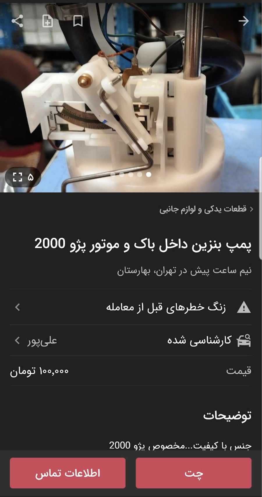
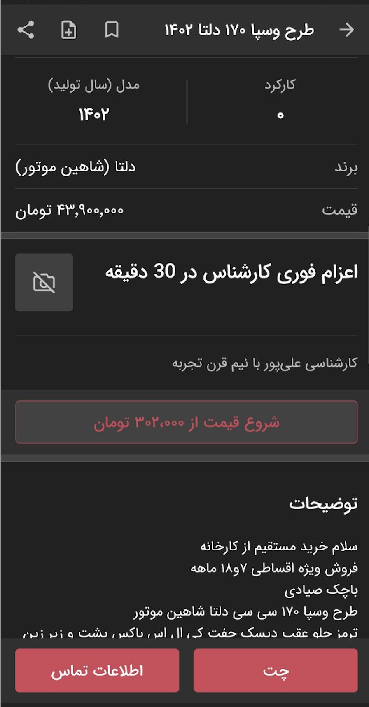

# الصاق افزونه آگهی

| Create Post AddOn |               |
|-------------------|---------------|
| Permissions       | ADD_ON_CREATE |
| Default Rate      | 100 R/WEEK    |

---

برای الصاق افزونه روی آگهی لازم است
API
زیر صدا زده شود. برای آگاهی از نحوه ساخت ویجت‌ها و قراردادن لینک در آنها، میتوانید به [قسمت ویجت‌ها](../widgets/index.md) مراجعه نمائید.

ریکوئست

```http request
POST https://api.divar.ir/v1/open-platform/add-ons/post/{{post_token}}
Content-Type: application/json
x-api-key: {{apikey}}
X-Debug-Token: {{debug_token}}

{
    "widgets": {
        "widget_list": [
            {
                "widget_type": "LEGEND_TITLE_ROW",
                "data": {
                    "@type": "type.googleapis.com/widgets.LegendTitleRowData",
                    "title": "کارشناسی دمپایی",
                    "subtitle": "کارشناسی",
                    "has_divider": true,
                    "image_url": "logo"
                }
            }
        ]
    }
    "link_in_spec": "https://your.site.ir",
    "semantic": {
        "year": 1398,
        "usage": 100000
    },
    "notes": "any notes you want to get back on list api"
}
```
- فیلد `widgets` باید با ویجت های مورد نظر پر شود.
- فیلد  `notes` برای یاداشت های مورد نظرتون روی افزونه می‌باشد می‌توانید با api list این اطلاعات رو پس بگیرید.
- فیلد `semantic` برای اطلاعات معنایی می باشد که در [اینجا](./semantic.md) بیشتر توضیح داده شده است.

در این ریکوئست علاوه بر لیست ویجت ها ، یک فیلد دیگر با نام link_in_spec وجود دارد. این فیلد برای app های با سرویس تایپ REPORT_INSPECTION کاربرد دارد. در صورتی که این فیلد پر شود ، علاوه بر نمایش افزونه، یک ویجت score row در ابتدای صفحه ی پست لیست قسمت مشخصات آگهی اضافه میشود. این امر برای پروموت کردن این نوع افزونه ها کاربرد دارد. در صروتی که کاربر روی این ویجت کلیک کند ، وارد لینک قرار داده شده در فیلد link_in_spec میشود.
همانطور که در تصویر زیر مشاهده میشود ، این اسکور رو با متن کارشناسی شده و اسم شرکت با استفاده از فیلد Display تعریف شده برای app نمایش داده میشود.



ریسپانس

```json
{}
```
# نحوه عملکرد
برای افزایش پایداری و ریسپانس تایم الصاق افزونه به صورت ناهنگام(Async) انجام می‌شود. به همین دلیل id در ریسپانس برگردانده نمی‌شود. در هنگام کال createpostaddon صرفا اعتبار سنجی مقادیر و فرمت اطلاعات داده شده انجام می‌شود در صورت رد شدن هر یک از اعتبار سنجی ها در ریسپانس ارور پس‌داده خواهد شد. بعد از اعتبار سنجی ریسپانس داده میشود در صورتی که الصاق افزونه هنوز صورت گرفته نشده است. پس از مدت کمی الصاق صورت میگیرد و از ریسپانس کد ۲۰۰ میتوانید مطمئن باشید حتما افزونه شما ساخته خواهد شد.


# جایگاه نمایش افزونه ها
افزونه هایی که user approved باشند ، به جای نمایش در انتهای آگهی ، پیش از قسمت توضیحات خود کاربر ، نمایش داده میشوند. باقی افزونه ها که شامل این شرط نباشند ، در انتهای آگهی قابل مشاده هستند.



- برای حذف افزونه از آگهی میتوانید آیدی آن را نگهداری کرده و در آینده از API خذف افزونه استفاده نمائید
