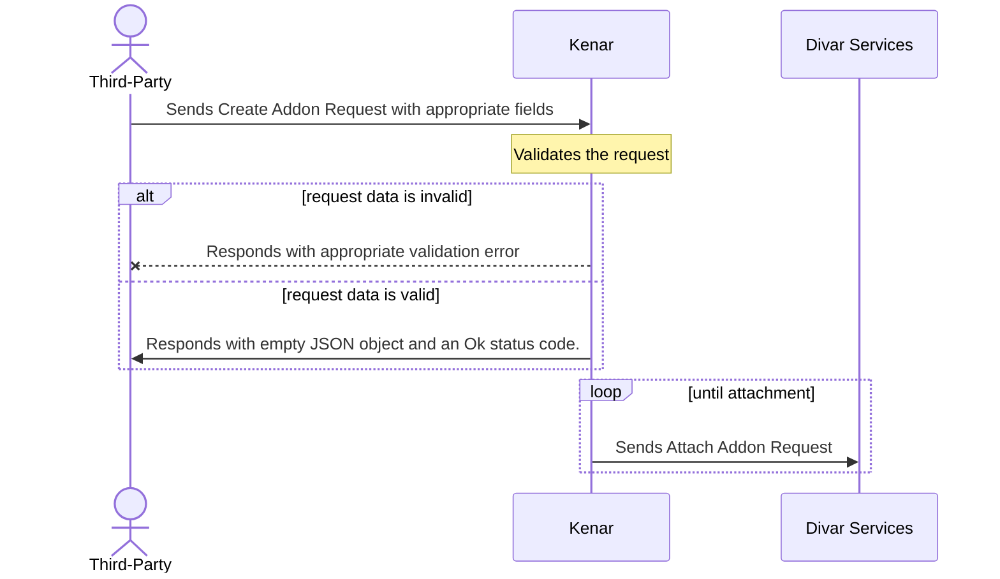

# الصاق افزونه آگهی

| Create Post AddOn |               |
|-------------------|---------------|
| Permissions       | ADD_ON_CREATE |
| Default Rate      | 100 R/WEEK    |

---

برای الصاق افزونه روی آگهی لازم است
API
زیر صدا زده شود. برای آگاهی از نحوه ساخت ویجت‌ها و قراردادن لینک در آنها، میتوانید به [قسمت ویجت‌ها](../widgets/ReadMe.md) مراجعه نمائید.

### ریکوئست

```http request
POST https://api.divar.ir/v1/open-platform/add-ons/post/{{post_token}}
Content-Type: application/json
x-api-key: {{apikey}}
X-Debug-Token: {{debug_token}}

{
    "widgets": {
        "widget_list": [
            {
                "widget_type": "LEGEND_TITLE_ROW",
                "data": {
                    "@type": "type.googleapis.com/widgets.LegendTitleRowData",
                    "title": "کارشناسی دمپایی",
                    "subtitle": "کارشناسی",
                    "has_divider": true,
                    "image_url": "logo"
                }
            }
        ]
    }
    "semantic": {
        "year": 1398,
        "usage": 100000
    },
    "notes": "any notes you want to get back on list api"
}
```

- فیلد `widgets` باید با ویجت های مورد نظر پر شود.
- فیلد  `notes`
 برای یاداشت های مورد نظرتون روی افزونه می‌باشد می‌توانید با
 [تابع لیست](./list.md)
  این اطلاعات رو پس بگیرید.
- فیلد `semantic` برای اطلاعات معنایی می باشد که در [اینجا](./semantic.md) بیشتر توضیح داده شده است.

### ریسپانس

```json
{}
```

## نحوه عملکرد


> برای افزایش پایداری و ریسپانس تایم الصاق افزونه به صورت ناهنگام(Async) انجام می‌شود. به همین دلیل id در ریسپانس برگردانده نمی‌شود.

در هنگام کال این تابع صرفا اعتبار سنجی مقادیر و فرمت اطلاعات داده شده انجام می‌شود.
 در صورت رد شدن هر یک از اعتبار سنجی ها در ریسپانس ارور پس‌داده خواهد شد.
  بعد از اعتبار سنجی ریسپانس موفق یا علت رد درخواست الصاق افزونه پس داده میشود در حالی که الصاق افزونه هنوز انجام نشده است.
   پس از مدتی افزونه برای آگهی تولید میشود و از ریسپانس کد ۲۰۰ میتوانید مطمئن باشید حتما افزونه شما ساخته خواهد شد.

نکته: تنها اعتبار سنجی که انجام نمی‌شود توکن آگهی/پروفایل می‌باشد در صورت اشتباه بودن این مقدار افزونه ساخته نمی‌شود و در ریسپانس قبول شده خواهید دید پس از صحت توکن اطمینان حاصل نمائید.


# جایگاه نمایش افزونه ها
افزونه هایی که با تایید کاربر از طریق اوآت الصاق شده باشند، به جای نمایش در انتهای صفحه آگهی، پیش از قسمت توضیحات آگهی، نمایش داده میشوند.


