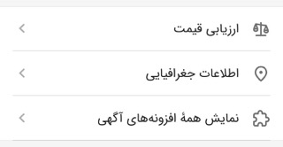
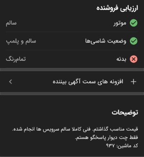

# افزونه سمت بیننده
این دسته افزونه این گونه خواهد بود که در صورت باز بودن اپ شما روی شهر و دسته‌بندی مربوطه سرویس شما تحت عنوان یکی از دسته های مربوطه (که در پایین چند مثال از آن را می‌بینید)

به کاربر بیننده نمایش داده خواهد شد، و در صورتی که بیننده روی دسته بندی که سرویس شما در آن قرار دارد کلیک کند اپ شما به بیننده نمایش داده میشود و با کلیک روی آن کاربر به
fallback_url
ای که در پنل کنار قرار داده‌اید به همراه پارامتر های
`post_token`
و
`return_url`
ریدایرکت خواهد شد، با استفاده از
`post_token`
مینوانید اطلاعات مورد نیازتان را به دست آورید و خدمات مد نظرتان را به بیننده ارائه دهید
همچنین در پایان باید بیننده را به 
`return_url`
بازگردانید

 

برای تست کردن سرویس تون میتونید با ساختن یک آگهی تستی و زدن گزینه ای به اسم
"افزونه های سمت آگهی بیننده"
برنامه خودتون رو به عنوان یک سرویس دهنده به بیننده تست کنید

