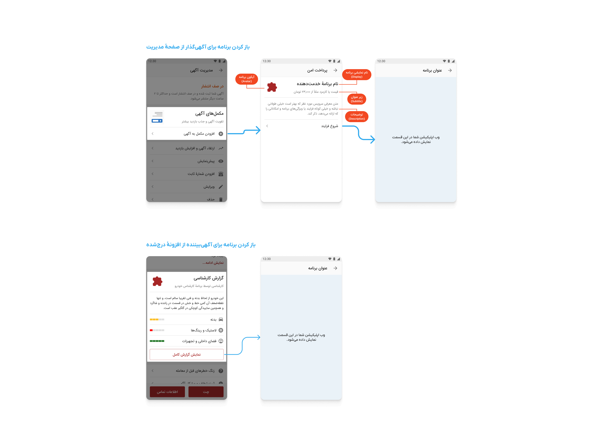
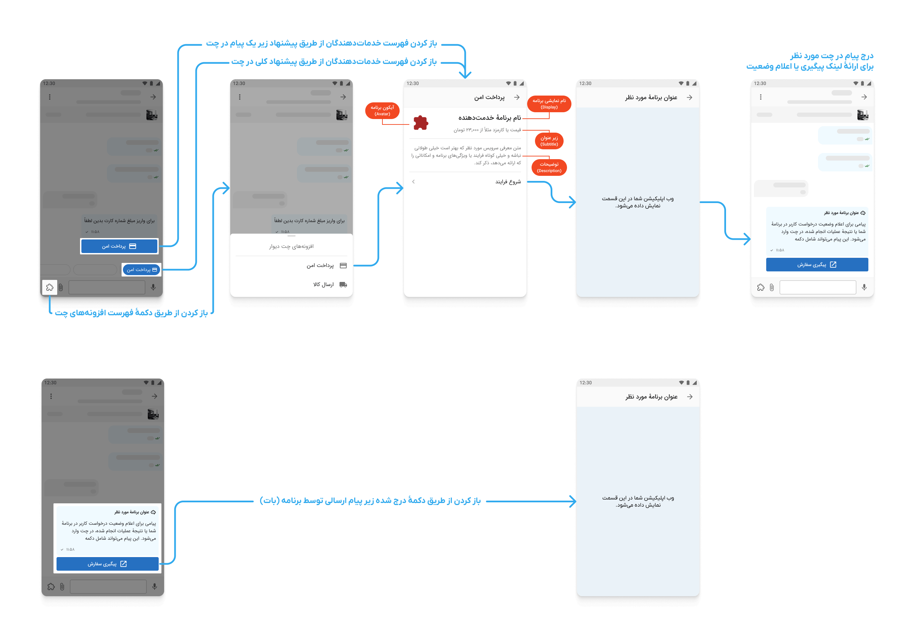

# کنار دیوار

 

**کنار دیوار** بستری برای افزودن اطلاعات و خدمات به دیوار است.
با ارائهٔ خدمات خود در **کنار دیوار**، به کاربران دیوار کمک کنید تجربهٔ خرید و فروش ساده‌تر، مطمئن‌تر و دلنشین‌تری را تجربه کنند.
در **کنار دیوار** می‌توانید:

- به آگهی‌گذاران کمک کنید اطلاعات تکمیلی در آگهی‌های خود درج کنند.
- با همکاری آگهی‌گذاران خدمات تکمیلی مرتبط با آگهی‌ها ارائه دهید.
- با ارائهٔ خدمات در چت، تعامل کاربران را در راستای معاملهٔ سریع‌تر و مطمئن‌تر تسهیل کنید.

---

 

## خدمات روی آگهی‌ها 📜

در حال حاضر خدماتی که از طریق صفحات مربوط به آگهی می‌توانید ارائه دهید، در قالب زیر است:

۱. برنامه‌های مرتبط با آگهی (از نظر دسته، شهر یا موارد دیگر) در قسمت مدیریت آگهی به کاربر پیشنهاد می‌شود.\
۲. کاربر پس از انتخاب برنامه شما، به [آدرس مشخص شده][راهنما » مدیریت اپ »‌ تعامل در آگهی] هدایت می‌شود و وب‌اپلیکیشن شما در اپ دیوار باز خواهد شد.\
۳. در صورت نیاز می‌توانید در وب‌اپ خود [اطلاعات آگهی][راهنما » اطلاعات آگهی]، [اطلاعات کاربر][راهنما » اطلاعات کاربر] یا [آگهی‌های کاربر][راهنما » آگهی‌های کاربر] (با [کسب اجازهٔ کاربر][راهنما » احراز باز]) را از دیوار دریافت کنید.\
۴. به علاوه می‌توانید از کاربر [اجازهٔ درج محتوا][راهنما » احراز باز] در آگهی مورد نظر را نیز بگیرید. این محتوا از [ویجت‌های][راهنما » ویجت‌ها] دیوار مثل متن، عکس، امتیاز و ... تشکیل می‌شود.\
۵. پس از پایان کار، برنامه باید [کاربر را به دیوار برگرداند][راهنما » مدیریت اپ »‌ تعامل در آگهی]. \
۶. پس از انتشار، کاربران آگهی‌بیننده می‌توانند با محتوای درج‌شده تعامل داشته‌باشند (برای مثال، با استفاده از دکمه‌های اضافه شده، آدرس‌های مشخص شده در برنامه شما را باز کرده و با وب‌اپلیکیشن شما تعامل کنند). دقت کنید که حتما بعد از پایان تعامل با کاربر، وی را [به دیوار بازگردانید][راهنما » مدیریت اپ »‌ تعامل در آگهی].

 

> 💡 **_مثال_** \
> یک سرویس پرداخت آنلاین، بعد از ثبت آگهی کالای نو، با فروشنده هماهنگ کرده، اطلاعات و مجوزهای لازم را از وی می‌گیرد، سپس با افزودن دکمهٔ پرداخت آنلاین به آگهی، به آگهی‌‌بینندگان امکان پرداخت سریع و از طریق درگاه را فراهم می‌آورد.

 

### ارائه خدمات به بیننده آگهی

در این حالت سرویس شما به عنوان سرویس سمت بیننده آگهی ثبت می‌شود، در هنگام بازدید آگهی به کاربر معرفی خواهد شد و اگر کاربر بیننده انتخاب کند به سایت شما منتقل خواهد شد و اطلاعات مورد نیاز بیننده آگهی را در اختیار او قرار می‌دهید
 
برای اطلاعات دقیق تر [اینجا][راهنما » افزونه‌های بیننده آگهی] را مطالعه کنید

> 💡 **_مثال_** \
> یک سرویس ارزیابی قیمت خودرو تحت عنوان ارزیابی قیمت در دسته‌های خودرو به بیننده های آگهی نمایش داده می‌شود، کاربر در صورت انتخاب کردن این سرویس به سایت آن ریدایرکت خواهد شد. سرویس مذکور اطلاعات آگهی را دریافت کرده و درباره مناسب بودن یا نبودن قیمت به کاربر اطلاعات می‌دهد.

 

---

📖 اطلاعات بیشتر در مورد افزونه‌های آگهی‌ها را [اینجا بخوانید][راهنما » افزونه‌های آگهی].

---

 

## خدمات در چت 💬

ارائهٔ خدمات در چت دیوار به دو روش اصلی انجام می‌شود:

### خدمات افزونه‌ای در چت

این روش برای ارائه خدمات تکمیلی در چت‌های موجود کاربران استفاده می‌شود:

۱. برنامه‌های مرتبط با آگهی و چت کاربران پیشنهاد داده می‌شود.\
۲. پس از انتخاب برنامه شما توسط کاربر، درخواستی از طرف دیوار به [آدرسی که از قبل توسط شما در پنل مشخص شده][راهنما » مدیریت اپ »‌ تعامل در چت] ارسال می‌شود و کاربر به آدرسی که در پاسخ به درخواست دیوار می‌دهید، هدایت می‌شود.\
۳. در این مرحله شما می‌توانید [اطلاعات آگهی][راهنما » اطلاعات آگهی] یا [اطلاعات کاربر][راهنما » اطلاعات کاربر] را ([با اجازهٔ کاربر][راهنما » احراز باز]) از دیوار بگیرید.\
۴. به علاوه، در این مرحله می‌توانید [با اجازهٔ کاربر][راهنما » احراز باز]، در چت‌ [پیام ارسال کنید][راهنما » افزونه‌های چت » ارسال پیام]. \
۵. شما می‌توانید به پیام‌های ارسالی در چت، دکمه‌هایی برای طرفین چت ضمیمه کنید که کاربران با استفاده از آن‌ها، [با برنامهٔ شما تعامل نمایند][راهنما » افزونه‌های چت » ارسال پیام‌ » دکمه].\
۶. بعد از پایان تعامل، برنامهٔ شما باید کاربر را [به دیوار برگرداند][راهنما » مدیریت اپ »‌ تعامل در چت].

### خدمات چت‌بات

کنار دیوار امکان ایجاد چت‌بات اختصاصی برای ارائه خدمات تعاملی را فراهم کرده است. چت‌بات شما در آدرس `https://divar.ir/chat/addon_{your_app_slug}` در دسترس کاربران قرار می‌گیرد و دو حالت تعامل دارد:

#### تعامل پاسخ‌محور

در این حالت کاربر مکالمه را شروع کرده و شما پاسخ می‌دهید:

۱. کاربر پیام شروع را به چت‌بات شما ارسال می‌کند.\
۲. پیام کاربر از طریق webhook به [آدرس رویدادهای شما][راهنما » مدیریت اپ » رویدادها] ارسال می‌شود.\
۳. شما با استفاده از API های کنار دیوار، پاسخ مناسب را همراه با دکمه‌ها و اکشن‌های تعاملی ارسال می‌کنید.\
۴. کاربر می‌تواند با دکمه‌ها تعامل کرده و خدمات مورد نظر را دریافت کند.

#### تعامل پیش‌فعال

در این حالت شما مکالمه را شروع می‌کنید:

۱. از کاربر [اجازهٔ ارسال پیام مستقیم][راهنما » احراز باز] دریافت می‌کنید.\
۲. با استفاده از `user_id` و `access_token`، می‌توانید پیام اول را به کاربر ارسال کنید.\
۳. کاربر پاسخ داده و مکالمه ادامه می‌یابد.\
۴. شما خدمات خود را از طریق پیام‌ها، دکمه‌ها و لینک‌های تعاملی ارائه می‌دهید.
 

> 💡 **_مثال_** \
>  برنامهٔ پرداخت به کاربر خریدار پیشنهاد شده و وی برنامه را باز کرده، به آدرس ارسالی هدایت می‌شود. برنامه اطلاعات آگهی و شمارهٔ کاربر را دریافت کرده و از طریق درگاه بانکی، مبلغ را از وی دریافت می‌کند. برنامهٔ پرداخت سپس پیامی در چت ارسال می‌کند که ذیل آن دکمه‌ای برای فروشنده قرار گرفته تا از طریق آن، مبلغ را دریافت کند. فروشنده با زدن دکمه به آدرس مشخص‌شده هدایت می‌شود. در این مرحله، برنامه شماره تماس او را از دیوار دریافت کرده و پس از گرفتن اطلاعات بانکی، مبلغ را به حساب وی منتقل می‌کند.

 

> 💡 **_مثال_** \
>  برنامهٔ تنظیم قرارداد به کاربر پیشنهاد می‌شود. وی از طریق برنامه نمونه قرارداد دلخواه را انتخاب کرده، اطلاعات مربوط به خود را وارد کرده و به شکل دیجیتال امضاء می‌کند. برنامه لینک مربوط به این قرارداد را به همراه پیامی در چت برای طرف دیگر ارسال می‌کند، کاربر دیگر با باز کردن لینک مشخص شده قرارداد را پر نموده و به صورت دیجیتال امضاء می‌کند، سپس برنامه نسخه امضاء شده را برای طرفین در چت ارسال می‌کند.

 

📖 اطلاعات بیشتر در مورد افزونه‌های چت را [اینجا بخوانید][راهنما » افزونه‌های چت].

 

## شروع سریع

:::danger ⚠️ هشدار مهم
لطفاً قبل از شروع توسعه برنامه، تیکت پشتیبانی ایجاد کنید و ایده کسب‌وکار خود را با تیم کنار دیوار در میان بگذارید تا از همسویی برنامه شما با سیاست‌ها و اهداف کنار دیوار اطمینان حاصل شود.

    <a href="https://divar.ir/kenar/management/issues/new" className="button button--danger">ثبت تیکت پشتیبانی</a>

:::

برای ارسال اولین درخواست به API های کنار دیوار این مراحل را بروید.

۱. در [پنل کنار][پنل کنار] دیوار وارد شوید.\
۲. یک برنامهٔ تستی بسازید.\
۳. برای برنامه مورد نظرتان کلید API بسازید.\
۴. در قسمت آگهی‌های تستی یک آگهی بسازید تا بتوانید راحت‌تر تست کنید.\
۵. می‌توانید [فهرست درخواست‌ها](#فهرست-درخواستها) را ببینید و با استفاده از کلید API درخواست بفرستید.

### ویدیوهای آموزشی

1. [مفاهیم و مقدمات کنار دیوار](https://www.aparat.com/v/bhi2mx2)
2. [جزئیات APIها](https://www.aparat.com/v/zpgw3gb)
3. [مقدمات OAuth و دریافت توکن](https://www.aparat.com/v/wgya70s)

### فهرست درخواست‌ها (Swagger)

**فهرست درخواست‌ها و اسکیما رکوئست و ریسپانس در این [لینک](/openapi-doc) موجود است.**

### احراز باز (OAuth2)

برخی قابلیت‌ها، مثل دریافت اطلاعات شخصی کاربران یا افزودن محتوا به آگهی، نیازمند دریافت اجازه از کاربر هستند.
در **کنار دیوار**، این فرآیند بر مبنای [استاندارد OAuth 2.0][احراز باز] انجام می‌شود.
برای کار با این استاندارد، در زبان‌ها و فریم‌ورک‌های مختلف، ابزارهای متنوعی وجود دارند که [برخی از آن‌ها را می‌توانید اینجا ببینید][احراز باز » ابزارها].
برای اطلاعات بیشتر در این مورد، [اینجا را بخوانید][راهنما » احراز باز].

### تعامل با سرویس‌های دیوار

برای استفاده از قابلیت‌های **کنار دیوار** باید درخواست‌های HTTP به آدرس مربوطه ارسال کنید. هر درخواست باید شامل یک [کلید API][راهنما » کلیدها] متعلق به برنامهٔ شما باشد تا دیوار از طریق آن هویت شما را احراز کند. برای ایجاد کلید برای برنامهٔ خود به [صفحهٔ کلیدها در پنل کنار][پنل کنار‌ » کلیدها] مراجعه کنید.

 

> 🔒 **_نکات امنیتی_** \
> \
> 🔑 کلید را در هدر `x-api-key` قرار دهید. درخواست‌های بدون کلید رد خواهند شد. \
> 🙈 در پنل کنار، کلید API را فقط در زمان ساخت می‌توانید ببینید. در نگهداری از آن دقت کنید. \
> 🤹 یک اپلیکیشن می‌تواند کلیدهای مختلف با دسترسی‌های متفاوت داشته باشد. \
> 🛂 مطمئن شوید که هر کلید کمینهٔ دسترسی‌های مورد نیاز را دارد. \
> 🕰️ کلیدها را به شکل دوره‌ای و منظم پاک کرده و با کلید‌های جدید جایگزین کنید. \
> 🔥 هر اپلیکیشن می‌تواند فقط یک کلید برای [دریافت اجازه‌های مختلف از کاربر][راهنما » احراز باز] داشته باشد. \
> 📖 برای اطلاعات بیشتر در مورد امنیت کلیدها [اینجا را بخوانید][راهنما » کلیدها » امنیت].
>  

---

### پروژه‌های قدرت‌گرفته از کنار دیوار

| عنوان        | لینک                                                                    | زبان برنامه‌نویسی |
| ------------ | ----------------------------------------------------------------------- | ----------------- |
| مستر دیاگ    | [مستر دیاگ](https://github.com/amirsalarsafaei/mrdiag)                  | Python            |
| ریتینو       | [ریتینو](https://github.com/mohammadmasoumi/ratino)                     | Python            |
| مثال ساده    | [مثال ساده](https://github.com/Mobin-Pourabedini/kenar-divar-example)   | Python            |
| بازی ایکس او | [بازی ایکس او](https://github.com/amirsalarsafaei/kenar-xo/tree/master) | Python            |
| طوطی فینگلیش | [طوطی فینگلیش](https://github.com/majidalaeinia/finglish-parrot)        | PHP               |

### محیط تست

- برای توسعه و تست در کنار [این مستندات](./development/README.md) را مطالعه کنید.
- برای اتصال یک آدرس عمومی و قابل دسترس در اینترنت به localhost خود، می‌توانید از سرویس‌هایی مثل [ngrok](https://ngrok.com/) یا [Pinggy](https://pinggy.io/) یا [Loophole](https://loophole.cloud/) استفاده کنید.

# کتابخانه‌های SDK (آزمایشی)

برای راحتی توسعه‌دهندگان، کتابخانه‌های SDK برای زبان‌های مختلف برنامه‌نویسی فراهم شده است. این کتابخانه‌ها در حال حاضر در مرحله آزمایشی هستند.

|                                                                                                       زبان برنامه‌نویسی                                                                                                       | لینک گیت‌هاب                                                                                 |
| :---------------------------------------------------------------------------------------------------------------------------------------------------------------------------------------------------------------------------: | :------------------------------------------------------------------------------------------- |
|          [Python](https://github.com/divar-ir/kenar-sdk-python)         | [github.com/divar-ir/kenar-sdk-python](https://github.com/divar-ir/kenar-sdk-python)         |
|                  [Go](https://github.com/divar-ir/kenar-sdk-go)                 | [github.com/divar-ir/kenar-sdk-go](https://github.com/divar-ir/kenar-sdk-go)                 |
|  [JavaScript](https://github.com/divar-ir/kenar-sdk-javascript) | [github.com/divar-ir/kenar-sdk-javascript](https://github.com/divar-ir/kenar-sdk-javascript) |
|                [PHP](https://github.com/divar-ir/kenar-sdk-php)               | [github.com/divar-ir/kenar-sdk-php](https://github.com/divar-ir/kenar-sdk-php)               |

---

> ☎️ **_تماس با ما_**
>
> - پاسخ سوالتان را در این مستندات پیدا نکرده‌اید؟ سوالات خود را [اینجا][ایشوی جدید] بپرسید.
> - برای افزونه‌ی خود درخواست تغییر یا انتشار دارید؟ در توسعه‌ی افزونه‌ی خود دچار مشکلی شده‌اید؟ درخواست خود را در [پنل کنار دیوار][پنل کنار] ثبت کنید.
> - برای طرح سایر مشکلات، موضوعات، نظرات، پیشنهادات، و ... با ما از طریق آدرس ایمیل kenar.support@divar.ir تماس بگیرید.

# دسترسی سریع

- [پنل کنار][پنل کنار]
- [تلگرام کنار][تلگرام کنار]
- [ایمیل ساپورت کنار][ایمیل ساپورت کنار]

[پنل کنار]: https://divar.ir/kenar
[تلگرام کنار]: https://t.me/kenar_divar
[ایمیل ساپورت کنار]: mailto:kenar.support@divar.ir
[پنل کنار » اپ‌ها]: https://divar.ir/kenar/management/apps
[راهنما » مدیریت اپ]: ./management
[راهنما » مدیریت اپ »‌ تعامل در آگهی]: management#تعامل-با-کاربر-پس-از-ثبت-آگهی
[راهنما » مدیریت اپ »‌ تعامل در چت]: management#تعامل-با-کاربر-در-چت
[راهنما » اطلاعات آگهی]: ./post/get_post.md
[راهنما » آگهی‌های کاربر]: ./post/get_user_posts.md
[راهنما » احراز باز]: ./oauth
[راهنما » اطلاعات کاربر]: ./oauth/get_user.md
[راهنما » افزونه‌های آگهی]: ./addons
[راهنما » افزونه‌های بیننده آگهی]: ./addons/demand_addon.md
[راهنما » افزونه‌های آگهی » ساخت]: ./addons/post_addons.md
[راهنما » افزونه‌های آگهی » معنی]: ./semantic/semantic_data.md
[راهنما » افزونه‌های آگهی » تست]: ./development/README.md
[راهنما » ویجت‌ها]: ./widgets
[ویجت‌ها » فیگما]: https://www.figma.com/file/ZhhSihwKTjiER1VUDX4ovh/%F0%9F%93%92-Kenar-Docs-(WIP)?type=design&node-id=2-4&mode=design&t=RbiQ2ay29ombNJKz-11
[راهنما » افزونه‌های چت]: ./chat
[راهنما » افزونه‌های چت » ارسال پیام]: chat/users_conversations.md
[راهنما » افزونه‌های چت » ارسال پیام‌ » دکمه]: chat/users_conversations.md#کلیک-کاربر-روی-دکمهٔ-درج-شده-زیر-پیام
[راهنما » مدیریت اپ » رویدادها]: ./management#رویدادها
[راهنما » مدیریت اپ » رویدادها]: ./management#رویدادها
[راهنما » رویدادها]: ./events
[احراز باز]: https://oauth.net/2/
[احراز باز » ابزارها]: https://oauth.net/code/
[راهنما » کلیدها]: ./management/api-keys.md
[راهنما » کلیدها » امنیت]: ./management/api-keys.md#امنیت-کلیدها
[راهنما » افزونه‌های کاربر]: ./addons#افزونه-کاربر
[راهنما » افزونه‌های کاربر » اطلاعات معنایی]: ./semantic/semantic_data.md
[راهنما » افزونه‌های کاربر » ساخت]: ./addons/user-addons.md
[راهنما » افزونه‌های کاربر » حذف]: ./addons/user-addons.md#حذف-افزونه-کاربر
[راهنما » اطلاعات معنایی کاربر]: ./semantic
[راهنما » اطلاعات معنایی کاربر » درج]: ./semantic/user_semantic_create
[راهنما » اطلاعات معنایی کاربر » حذف]: ./semantic/user_semantic_delete
[راهنما » تیکت پرداخت]: ./payment-ticket
[راهنما » تیکت پرداخت » بررسی صحت]: ./payment-ticket/validate.md
[ایشوی جدید]: https://github.com/divar-ir/kenar-docs/issues/new
[راهنما » آگهی]: ./post
[راهنما » مقادیر]: ./assets
[راهنما » اطلاعات آگهی » جستجو]: ./post/search_post.md

  

  
