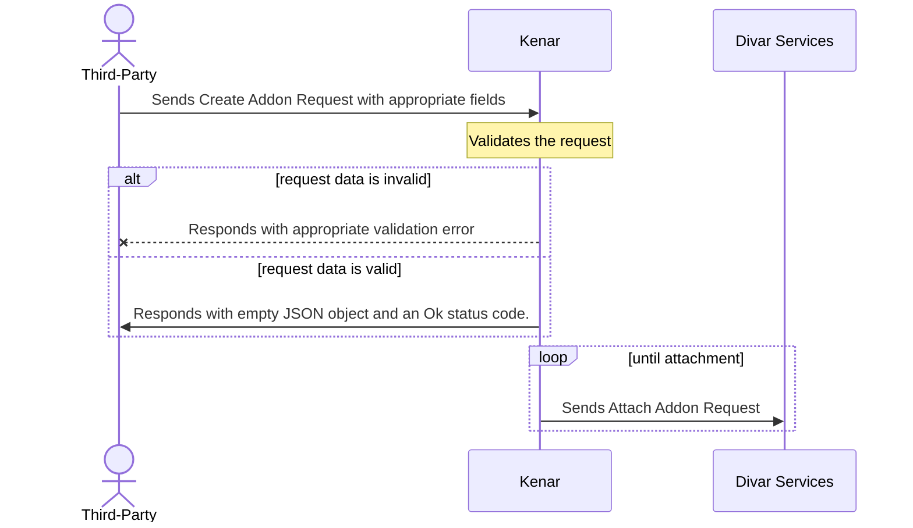

# ساخت و بروزرسانی افزونه کسب‌و‌کار

# افزونه تایید شده
اکثر برنامه‌ها برای منتشر شدن باید اجازه کاربر را جهت درج افزونه طبق فرایند [احراز باز](../oauth) دریافت کنند.
برای درج افزونه تایید شده می‌توانید با توجه به نیاز، از دو اسکوپ زیر استفاده کنید.

| اسکوپ احراز باز                 | توضیحات                                          | مثال                       |
|---------------------------------|--------------------------------------------------|----------------------------|
| BUSINESS_ADDON_CREATE.\{BUSINESS_TOKEN} | درج افزونه بر روی اگهی‌های کسب‌و‌کار با توکن 59e6301a-8ebd-4638-968a-b58fc20414ff | POST_ADDON_CREATE.59e6301a-8ebd-4638-968a-b58fc20414ff |

توجه: این API به صورت عمومی در دسترس نیست و در مرحله تست قرار دارد.

---


- در هنگام فراخوانی این اندپوینت صرفا اعتبار سنجی مقادیر و فرمت اطلاعات داده شده انجام می‌شود.
- در صورت رد شدن هر یک از اعتبار سنجی ها در ریسپانس ارور پس‌داده خواهد شد.
- بعد از اعتبار سنجی ریسپانس موفق یا علت رد درخواست الصاق افزونه پس داده میشود در حالی که الصاق افزونه هنوز انجام نشده است.
- پس از مدتی افزونه برای آگهی تولید میشود و از ریسپانس کد ۲۰۰ میتوانید مطمئن باشید حتما افزونه شما ساخته خواهد شد.
- از این اندپوینت برای بروزرسانی نیز میتوانید استفاده کنید.



برای الصاق افزونه روی آگهی لازم است
API
زیر صدا زده شود. برای آگاهی از نحوه ساخت ویجت‌ها و قراردادن لینک در آنها، میتوانید به [قسمت ویجت‌ها](../widgets/ReadMe.md) مراجعه نمائید.

### ریکوئست
لینک این درخواست در [فهرست API-ها](https://divar-ir.github.io/kenar-docs/api-doc/#tag/addons/POST/v2/open-platform/addons/business/{business_token})

```http request
POST https://open-api.divar.ir/v2/open-platform/addons/business/{{business_token}}
Content-Type: application/json
x-api-key: {{apikey}}

Authorization: Bearer {{access_token}}

{
   "widgets": [
        {
            "description_row": {
                "text": "این یک دسکریپشن رو هست",
                "has_divider": false,
                "expandable": false
            },
        },
        {
          "event_row": {
            "title": "یه تایتل مناسب",
            "subtitle": "یه زیر تایتل مناسب تر",
            "label": "یه لیبل زیبا",
            "image_id": "someuuid.jpg",
            "has_divider": true,
            "icon_name": "ADD",
            "action": {
              "open_direct_link": "https://google.com"
            }
          },
        }
    ],
    "notes": "any notes you want to get back on list api"
}
```

- فیلد `widgets` باید با ویجت های مورد نظر پر شود.

### ریسپانس
با توجه به `status_code` خروجی این API از موفقیت یا خطای مربوطه مطلع خواهید شد.
```json
{}
```
