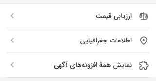
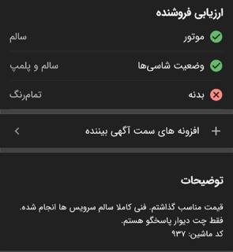

# افزونه‌های بینندگان آگهی

این دسته افزونه این گونه خواهد بود که در صورت باز بودن اپ شما روی شهر و دسته مربوطه سرویس شما تحت عنوان یکی از دسته های
مربوطه (که در پایین چند مثال از آن را می‌بینید)

  

به کاربر بیننده نمایش داده خواهد شد، و در صورتی که بیننده روی دسته‌ای که سرویس شما در آن قرار دارد کلیک کند اپ شما به بیننده نمایش داده میشود و با کلیک روی آن کاربر به `fallback_url` ای که در پنل کنار قرار داده‌اید به همراه پارامتر `post_token` ریدایرکت خواهد شد، با استفاده از `post_token` می‌توانید اطلاعات مورد نیازتان را به دست آورید و خدمات مد نظرتان را به بیننده ارائه دهید.

همچنین مشابه باقی ریدایرکت‌ها در پایان کار باید کاربر را [به دیوار هدایت کنید](../flow/completion.md).

 

برای تست کردن سرویس تون میتونید با ساختن یک آگهی تستی و زدن گزینه ای به اسم
"افزونه های سمت آگهی بیننده"
برنامه خودتون رو به عنوان یک سرویس دهنده به بیننده تست کنید

  

