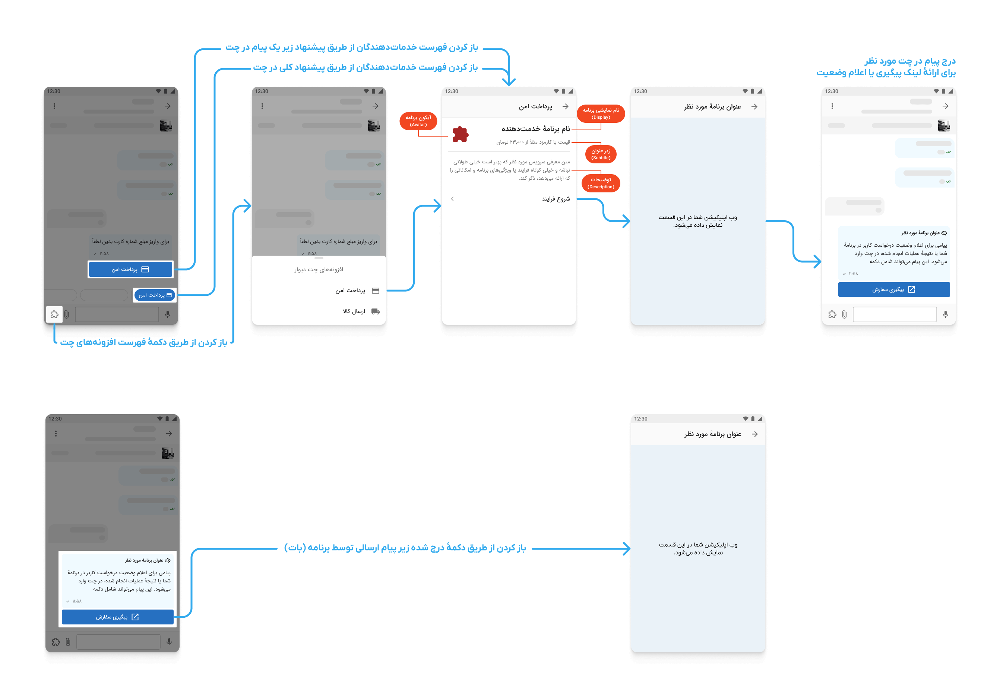

# 💬 افزونه‌های چت دیوار

## نمایش شما به عنوان خدمت‌دهنده به کاربران

در چت دیوار به طرفین چت بر اساس مواردی مثل شهر یا دسته‌ٔ آگهی خدماتی را پیشنهاد می‌دهیم که اگر برنامهٔ شما در آن گروه برنامه‌ها باشد به عنوان خدمت‌دهنده به کاربران معرفی می‌شود.
مثلاً شما می‌توانید به عنوان خدمت‌دهنده در افزونه‌های ارسال کالا در چت به کاربران معرفی شوید تا با بازکردن برنامهٔ وب شما، درخواست خود را ثبت کنند.

|                                |
|:-------------------------------------------------------------------------:|
| مسیری که کاربر برای دریافت خدمات شما در چت طی می کند |

## دریافت اطلاعات مربوط کاربر و مکالمه
پس از انتخاب شدن اپ شما توسط کاربر، اطلاعات طبق [این مستند](/docs/management/ReadMe.md#انواع-انتفال-داده-در-تعاملات) به اپلیکیشن شما انتقال داده می‌شود. شما باید مکانیزم دریافت و پردازش این اطلاعات را پیاده سازی کنید.

## ارائهٔ خدمات در برنامهٔ تحت وب شما و بازگشت به دیوار

پس از باز شدن برنامهٔ شما در اپ دیوار به صورت webview در اپلیکیشن‌های دیوار یا pop-up در وب دیوار، کاربر عملیات مورد نظر شما را در برنامهٔ شما طی می‌کند و خدمات مورد نظر را دریافت می‌کند. پس از اتمام کار برنامه می‌بایست کاربر را به دیوار برگرداند.\
پیشنهاد می‌کنیم در زمان‌هایی که دانستن نتیجهٔ کار برای هر دو طرف چت لازم است، [نتیجه را در چت اعلام کنید][چت»ارسال پیام] و دکمه‌ای برای پیگیری نیز در پیام درج کنید.

برای ارسال پیام در چت باید در برنامهٔ خود از طریق [احراز باز](../oauth) اجازهٔ ارسال پیام در چت را از کاربر گرفته‌باشید. \
همچنین ممکن است نیاز به دریافت دسترسی برای ارسال پیام در چت یا موارد دیگر از کاربر شوید که می‌توانید با استفاده از [احراز باز](../oauth) در موردشان از کاربر اجازه بگیرید.

## خواندن و ارسال پیام در تمام مکالمات مربوط به یک آگهی (آزمایشی)

برای خواندن پیام‌های چت به صورت لحظه‌ای می‌توانید از مستندات [مطلع شدن از رویداد‌های جدید](../events) استفاده کنید.

 همچنین برای ارسال پیام می‌توانید به مستندات [ارسال پیام در چت][چت»ارسال پیام] مراجعه کنید.

## مکالمه با کاربر به شکل چت‌بات (آزمایشی)

به منظور ایجاد و فعال‌سازی چت‌بات می‌توانید به پشتیبانی کنار دیوار تیکت بزنید و درخواست خود را مطرح کنید تا زیرساخت آن در دسترس شما قرار بگیرد.

در صورت برخوردار شدن از این امکان توسط پشتیبانی، با پر کردن مقدار `آدرس ارسال رویدادها` در پنل کنار، پیام‌های ارسالی به چت‌بات خود را دریافت خواهید کرد. برای اطلاعات بیشتر و فرمت درخواست‌های ارسالی می‌توانید [اینجا][راهنما » چت‌بات] را مطالعه کنید.

همچنین می‌توانید به کاربرانی که به چت‌بات شما پیام داده‌اند، پیام بفرستید. برای اطلاعات بیشتر [اینجا][راهنما » چت‌بات] را مطالعه کنید.
 
مثال چت: پیاده‌سازی
[بازی ایکس او](https://github.com/amirsalarsafaei/kenar-xo/tree/master)
با کنار دیوار

## دسترسی سریع

- [🔑 دریافت دسترسی‌ها از کاربر](../oauth)
- [↗️ ارسال پیام در چت کاربر][چت»ارسال پیام]
- [↗️ ارسال پیام در چت بات][راهنما » چت‌بات]

[آگهی]: ../management/#تعامل-با-کاربر-پس-از-ثبت-آگهی
[راهنما » احراز باز]: ../oauth
[امکانات چت]: #دسترسی-سریع
[راهنما » چت‌بات]: chatbot_conversations.md
[چت»ارسال پیام]: users_conversations.md

  

  
