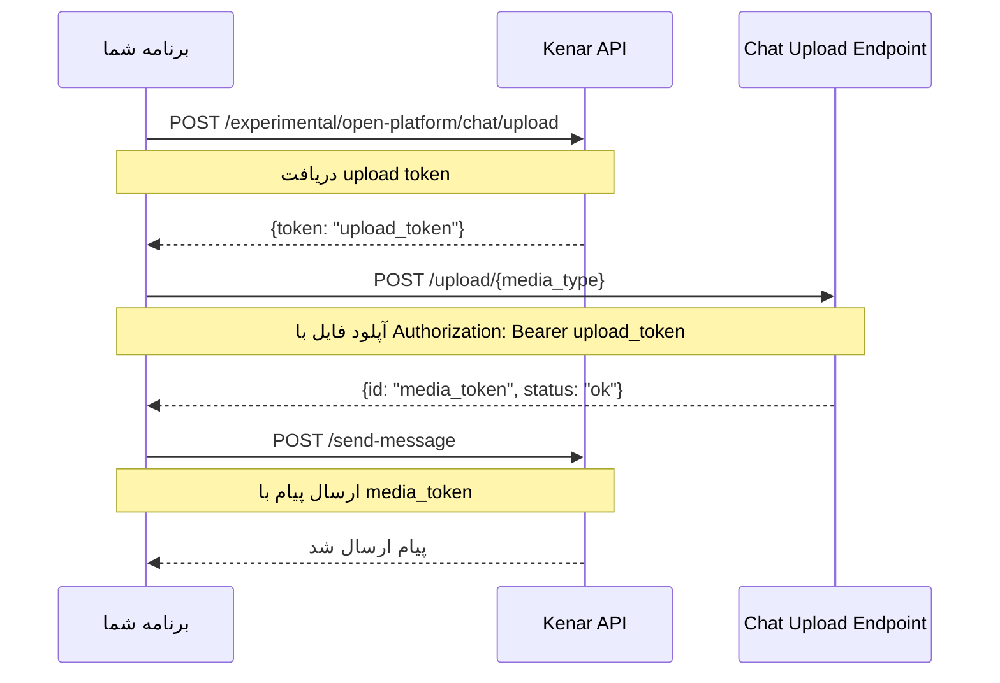

# آپلود media در چت دیوار (آزمایشی)

:::warning توجه
این API در حال حاضر در مرحله آزمایشی قرار دارد و ممکن است تغییرات آتی اعمال شود.
:::

این فرایند شامل ۳ مرحله است، ابتدا باید توکن جهت دریافت دسترسی به آپلود را دریافت کنید.
سپس باید با استفاده از توکن دریافتی فایل مدیا خود را آپلود کنید.
و در نهایت با `media_token` دریافتی در چت مد نظر خود media خودتون رو بفرستید

## نمای کلی



## محدودیت‌های فایل

:::info فرمت‌های مجاز
**تصاویر:** PNG, JPEG, JPG  
**فایل‌ها:** PDF, DOC, DOCX, XLSX, XLS, PPTX, PPT  
**صدا:** M4A, 3GP  
**ویدیو:** MP4  
:::

:::caution محدودیت‌های حجم
- **تصاویر:** حداکثر 5 مگابایت
- **فایل‌ها:** حداکثر 5 مگابایت  
- **صدا:** حداکثر 1.5 مگابایت
- **ویدیو:** حداکثر 50 مگابایت
:::

## مرحله ۱: دریافت توکن آپلود

ابتدا، شما نیاز دارید یک توکن آپلود دریافت کنید که برای مجوز آپلود رسانه شما استفاده خواهد شد.

### Request

```http
POST https://open-api.divar.ir/experimental/open-platform/chat/upload
Content-Type: application/json
x-api-key: {{apikey}}
```

### Response

```json
{
  "token": "your_upload_token"
}
```

## مرحله ۲: آپلود `media`

پس از دریافت `upload_token`، از آن برای آپلود فایل `media` خود استفاده کنید.

:::important نکته مهم
فایل باید به صورت **multipart/form-data** و در فیلد با نام **`file`** ارسال شود.
:::

### Request

```http
POST https://chat.divar.ir/upload/{{media_type}}
Authorization: Bearer {{upload_token}}
Accept: */*
Content-Type: multipart/form-data
```

**Form Data:**
```
file: [فایل شما] (نام فایل باید در value مشخص شده باشد)
```

### مثال با cURL

```bash
curl -X POST "https://chat.divar.ir/upload/image" \
  -H "Authorization: Bearer your_upload_token" \
  -H "Accept: */*" \
  -F "file=@/path/to/your/image.jpg"
```

### مثال با JavaScript (FormData)

```javascript
const formData = new FormData();
formData.append('file', fileInput.files[0]); // فایل و نام آن خودکار تنظیم می‌شود

fetch('https://chat.divar.ir/upload/image', {
  method: 'POST',
  headers: {
    'Authorization': `Bearer ${upload_token}`,
    'Accept': '*/*'
  },
  body: formData
})
```

### مثال با Python (requests)

```python
import requests

files = {
    'file': ('image.jpg', open('path/to/image.jpg', 'rb'), 'image/jpeg')
}

headers = {
    'Authorization': f'Bearer {upload_token}',
    'Accept': '*/*'
}

response = requests.post(
    'https://chat.divar.ir/upload/image',
    files=files,
    headers=headers
)
```

:::note انواع media_type
`media_type` می‌تواند یکی از مقادیر زیر باشد: `image`, `video`, `voice`, `file`
:::

### Response

```json
{
  "id": "your_media_token",
  "status": "ok"
}
```

## مرحله ۳: استفاده از `media_token` در چت شما

در نهایت، از `media_token` در پیام‌های مکالمه خود استفاده کنید.

این کار با پر کردن فیلد `media_token` در `object` پیام انجام می‌شود.

```json
{
  "media_token": "your_media_token"
}
```


:::info لینک‌های مرتبط
- ارسال پیام با media در چت‌بات را می‌توانید در [اینجا][راهنما » چت‌بات] بخوانید.
- ارسال پیام با media در چت را می‌توانید در [اینجا][چت»ارسال پیام] بخوانید.
:::

[راهنما » چت‌بات]: /chat/chatbot_conversations.md
[چت»ارسال پیام]: /chat/users_conversations.md
