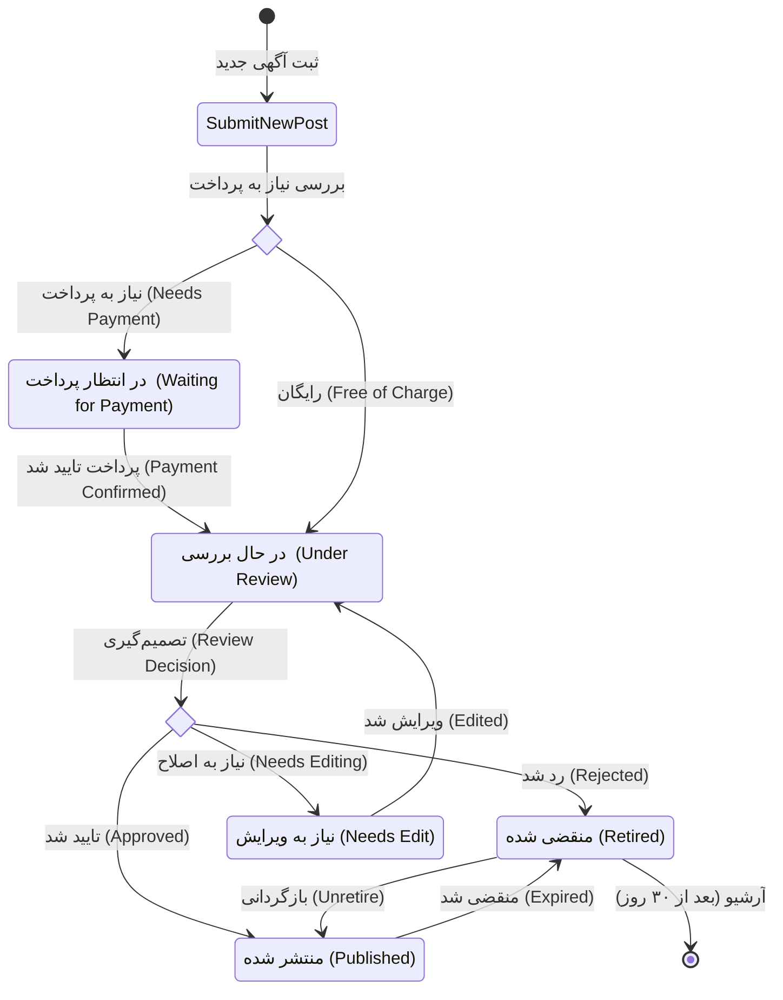

# آگهی (Post)

### مقدمه

در اکوسیستم دیوار، موجودیت (Entity) محوری و اصلی، **آگهی** یا **Post** می‌باشد. در پلتفرم کنار دیوار نیز این مفهوم بنیادین با همان ساختار و اهمیت وجود دارد. این مستند به منظور آشنایی عمیق توسعه‌دهندگان با جزئیات و ویژگی‌های خاص آگهی در پلتفرم کنار تهیه شده است.

### توکن (شناسه) آگهی

در دیوار، هر آگهی [**فعال**](#چرخه-حیات-آگهی-در-دیوار-divar-post-lifecycle) یک شناسه‌ی متنی منحصر به فرد دارد که به آن **توکن آگهی** (Post Token) گفته می‌شود. این توکن کلید اصلی برای دسترسی و ارجاع به یک آگهی خاص است.

**نحوه مشاهده و ساختار توکن آگهی:**
برای درک بهتر مفهوم توکن، می‌توانید به وب‌سایت دیوار ([divar.ir](https://divar.ir)) مراجعه کنید. پس از جستجو و کلیک بر روی یک آگهی، به آدرس URL آن در مرورگر خود توجه کنید. این URL ساختاری مشابه زیر دارد:

فرمت لینک‌های آگهی به صورت `https://divar.ir/v/{بخش-مربوط-به-سئو-و-خوانایی-URL}/{توکن-آگهی}` می‌باشد.
به عنوان مثال: `https://divar.ir/v/فروش-فوری-آپارتمان-اکازیون/gW4fL8Xq`

در این مثال:

- `gW4fL8Xq` همان **توکن آگهی** است.
- `فروش-فوری-آپارتمان-اکازیون` بخشی است که برای بهبود خوانایی URL و بهینه‌سازی برای موتورهای جستجو (SEO) استفاده می‌شود و در شناسایی یکتای آگهی نقشی ندارد.

> **مشخصات فنی توکن آگهی:**
>
> - **طول:** معمولاً ۸ یا ۹ کاراکتر.
> - **کاراکترهای مجاز:** ترکیبی از حروف بزرگ و کوچک انگلیسی و اعداد (`[_a-zA-Z0-9]`).
> - **ملاحظات ذخیره‌سازی برای توسعه‌دهندگان:** با توجه به اینکه طول این توکن ممکن است در آینده تا حداکثر ۱۶ کاراکتر افزایش یابد، هنگام طراحی پایگاه داده و تعریف فیلد مربوط به توکن آگهی، حتماً این افزایش احتمالی را در نظر بگیرید (مثلاً VARCHAR(20) یا بیشتر).

#### توکن مدیریت (Management Token)

توکن آگهی یک شکل دیگر نیز دارد که به آن **توکن مدیریت** گفته می‌شود. این توکن معمولاً از توکن عمومی آگهی طولانی‌تر است، اما پیشوند (prefix) آن با توکن عمومی آگهی یکسان می‌باشد.

**مثال:**
اگر توکن عمومی آگهی `post1234` باشد، توکن مدیریت آن می‌تواند مقداری شبیه به `post1234mngABCXYZ` داشته باشد (که `mngABCXYZ` پسوند مدیریتی است).

**نکته مهم برای توسعه‌دهندگان پلتفرم کنار:**
هدف از توضیح این بخش صرفاً ارائه اطلاعات تکمیلی برای درک عمیق‌تر سازوکار داخلی دیوار است. پلتفرم کنار **به هیچ وجه و تحت هیچ شرایطی توکن مدیریت (توکن خصوصی) را در اختیار شما قرار نمی‌دهد.**
قابلیت‌هایی نظیر ویرایش آگهی، نردبان کردن، یا سایر عملیات مدیریتی که ممکن است در دیوار مستلزم استفاده از توکن مدیریت باشند، در پلتفرم کنار از طریق **توکن عمومی آگهی** و با استفاده از APIهای مشخص و امنی که پلتفرم کنار برای این منظور ارائه می‌دهد، در دسترس شما خواهند بود. پلتفرم کنار مسئولیت مدیریت تعاملات لازم با سیستم‌های داخلی دیوار را بر عهده دارد.

### محتوای آگهی

هر آگهی در دیوار، ساختاری شبیه به یک سند (Document) یا یک فایل با اسکیمای (Schema) تعریف‌شده دارد. محتوای آگهی شامل دو بخش اصلی است:

1.  **فراداده‌های (Metadata) ثابت:** مجموعه‌ای از فیلدهای مشخص و ثابت که برای تمام آگهی‌ها، صرف‌نظر از دسته‌بندی، مشترک هستند و فرمت معینی دارند. مهم‌ترین این فراداده‌ها عبارتند از:

    - **توکن (Token):** شناسه‌ی منحصر به فرد آگهی که پیش‌تر توضیح داده شد.
    - **عنوان (Title):** عنوان اصلی آگهی.
    - **توضیحات (Description):** متن توضیحات آگهی.
    - **دسته‌بندی (Category):** شناسه یا نام دسته‌بندی اصلی که آگهی به آن تعلق دارد (مثلاً: `real_estate`, `cars`, `electronics`).
    - **شهر (City):** شناسه‌ی شهر محل آگهی.
    - **منطقه (District/Neighborhood):** شناسه‌ی منطقه یا محله‌ی دقیق‌تر در شهر (در صورت وجود و انتخاب کاربر).
    - **وضعیت (Status):** وضعیت فعلی آگهی (مثلاً: `published`, `pending_payment`, `expired`, `deleted`, `unconfirmed`). این وضعیت چرخه حیات آگهی را مشخص می‌کند.
    - **لیست تصاویر (Image List/URLs):** آرایه‌ای (لیستی) از شناسه‌ها یا URLهای تصاویر مرتبط با آگهی. این لیست می‌تواند در صورت عدم وجود تصویر، خالی باشد. ترتیب تصاویر در این لیست معمولاً مهم است.
    - **امکان چت (Chat Enabled):** یک مقدار بولی (boolean: `true` یا `false`) که نشان می‌دهد آیا قابلیت چت دیوار برای این آگهی از سوی آگهی‌دهنده فعال شده است یا خیر.
    - **زمان ایجاد (Creation Timestamp):** زمان دقیق ایجاد آگهی در سیستم (معمولاً به فرمت استاندارد مانند Unix Timestamp یا ISO 8601).
    - **زمان آخرین به‌روزرسانی (Last Update Timestamp):** زمان آخرین ویرایش یا به‌روزرسانی اطلاعات آگهی.

2.  **فیلدهای وابسته به دسته‌بندی (Category-Specific Fields):** سایر مقادیر، اطلاعات و فیلدهای آگهی، کاملاً بسته به [دسته‌بندی](#دستهبندی) که آگهی به آن تعلق دارد (مانند «املاک مسکونی»، «خودرو سواری»، «موبایل و تبلت» و...)، مقداردهی و تعریف می‌شوند. به عنوان مثال، فیلدهایی مانند «متراژ»، «تعداد اتاق خواب»، «سال ساخت» برای دسته‌بندی املاک، یا «کارکرد کیلومتر»، «رنگ بدنه»، «نوع سوخت» برای دسته‌بندی خودرو معنی‌دار خواهند بود.
3.  **فیلد‌های مربوط به بیزینس**: این فیلد ها در‌ صورتی موجود هستند که پست مربوط به فروشنده املاکی یا فروشگاهی یا ... باشد.

### وضعیت آگهی

بعد از [ثبت آگهی](#TODO) توسط کاربر، آگهی مسیری مانند شکل زیر طی می‌کند:

## چرخه حیات آگهی در دیوار (Divar Post Lifecycle)

یک نمودار جریان که چرخه حیات فرآیند ارسال پست در دیوار را نشان می‌دهد. این نمودار به توسعه‌دهندگان کمک می‌کند تا وضعیت‌های مختلف یک آگهی و انتقال بین این وضعیت‌ها را درک کنند.

### حالت‌های آگهی (Post States)

در زیر، وضعیت‌های مختلفی که یک آگهی می‌تواند در طول چرخه حیات خود در دیوار داشته باشد، به همراه ترجمه فارسی و توضیح مختصر ارائه شده است:

*   **`SubmitNewPost` / اقدام: ارسال پست جدید (Action: Submit New Post)**
    *   **توضیح:** نقطه شروع فرآیند هنگام ارسال پست جدید توسط کاربر.

*   **`payment_choice` / بررسی سهمیه/پرداخت (Quota/Payment Check)**
    *   **توضیح:** یک نقطه تصمیم‌گیری برای تعیین اینکه آیا پست نیاز به پرداخت دارد یا شامل سهمیه رایگان می‌شود.

*   **`W (Waiting for Payment)` / در انتظار پرداخت (Waiting for Payment)**
    *   **توضیح:** آگهی هزینه انتشار دارد و منتظر پرداخت توسط کاربر است.

*   **`N (Under Review)` / در حال بررسی (Under Review)**
    *   **توضیح:** آگهی پس از ارسال (و پرداخت در صورت نیاز) برای بررسی و تطابق با قوانین دیوار، به این وضعیت منتقل می‌شود.

*   **`review_choice` / نتیجه بازبینی (Review Outcome)**
    *   **توضیح:** یک نقطه تصمیم‌گیری پس از بررسی؛ آگهی یا تایید، یا رد (نیازمند ویرایش) می‌شود.

*   **`P (Published)` / منتشر شده (Published)**
    *   **توضیح:** آگهی توسط تیم بازبینی تایید شده و برای عموم کاربران در دیوار قابل مشاهده است.

*   **`E (Needs Edit)` / نیازمند ویرایش (Needs Edit)**
    *   **توضیح:** آگهی توسط تیم بازبینی رد شده است زیرا با قوانین مطابقت ندارد. کاربر باید آن را ویرایش و مجدداً برای بازبینی ارسال کند.
*   **`T (Retired)` / منقضی شده / بازنشسته (Retired)**
    *   **توضیح:** آگهی دیگر فعال نیست. این حالت می‌تواند به دلیل اتمام زمان نمایش آگهی (انقضا) یا اقدام کاربر برای بازنشسته کردن آن باشد. آگهی‌های بازنشسته معمولاً قابل بازنشر هستند.

*   **`A (Archived)` / بایگانی شده (Archived)**
    *   **توضیح:** آگهی‌های منقضی شده یا بازنشسته پس از گذشت مدت زمان مشخصی (مثلاً ۳۰ روز) به وضعیت بایگانی منتقل می‌شوند. آگهی‌های بایگانی شده معمولاً قابل بازنشر مستقیم نیستند و از دید کاربر پنهان می‌شوند مگر اینکه به بخش خاصی برای مشاهده آرشیو مراجعه کند.
    *   
**آگهی فعال**: منظور از آگهی فعال آگهی‌ای است که آرشیو نشده باشد.

### نمودار وضعیت آگهی (Post Status Diagram)

### دسته‌بندی

تودو

### TODO

todo
