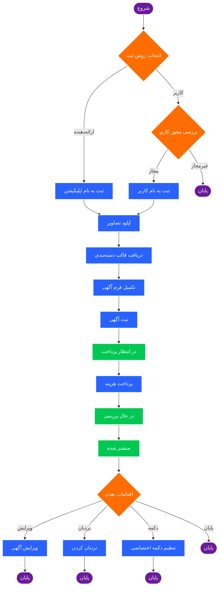

# ثبت آگهی

:::info دسترسی محدود
<div style={{textAlign: 'right'}}>

**این API در حال حاضر محدود است و برای استفاده از آن نیاز به تیکت و تأیید دارید.**

برای دسترسی به محیط staging یا production، لطفاً تیکت ایجاد کنید و موارد استفاده (use case) خود را برای بررسی و تأیید ارسال نمایید.

</div>
:::

## مفهوم کلی

API های ثبت آگهی به شما این امکان را می‌دهند که آگهی‌های جدید را به صورت برنامه‌نویسی در دیوار ایجاد کنید. این فرآیند به شما کنترل کامل بر روی محتوا، دسته‌بندی و اطلاعات آگهی می‌دهد.

### چه کاری انجام می‌دهید؟

در این فرآیند شما:

۱. **تصاویر را آپلود می‌کنید** - ابتدا تصاویر آگهی خود را به سرویس تصویر دیوار ارسال کرده و شناسه آن‌ها را دریافت می‌کنید
۲. **قالب دسته‌بندی را دریافت می‌کنید** - هر دسته‌بندی (مثل املاک، خودرو، موبایل) فیلدهای اختصاصی خود را دارد که باید پر شوند
۳. **آگهی را ثبت می‌کنید** - با ارسال اطلاعات عمومی و فیلدهای اختصاصی، یک آگهی در انتظار پرداخت ایجاد می‌شود
۴. **هزینه انتشار را پرداخت می‌کنید** - برای انتشار آگهی، باید هزینه آن را از اعتبار اپلیکیشن خود پرداخت کنید
۵. **آگهی بررسی و منتشر می‌شود** - پس از پرداخت، آگهی وارد صف بررسی شده و پس از تأیید در دیوار منتشر می‌شود

### دو مدل ثبت آگهی

**به عنوان ارائه‌دهنده (Provider):** آگهی به نام اپلیکیشن شما ثبت می‌شود. این مدل برای پلتفرم‌هایی مناسب است که محتوا را خودشان تولید می‌کنند.

**به عنوان کاربر (User):** آگهی به نام کاربر نهایی ثبت می‌شود. این مدل برای اپلیکیشن‌هایی مناسب است که واسط بین کاربران و دیوار هستند.

### چرخه عمر آگهی

```
در انتظار پرداخت ← پرداخت ← در حال بررسی ← منتشر شده
```

پس از انتشار، می‌توانید آگهی را ویرایش کنید، آن را نردبان کنید (به بالای لیست ببرید)، یا دکمه‌های اختصاصی برای آن تنظیم نمایید.

---

## انتخاب روش ثبت آگهی

در ابتدا دو گزینه برای ثبت آگهی در اختیار دارید:

### ۱. ثبت آگهی به عنوان ارائه‌دهنده (Provider)
از [API ثبت آگهی ارائه‌دهنده](/openapi-doc/post-submit-post-v-2) استفاده کنید. در این حالت آگهی به نام و با مشخصات ارائه‌دهنده (اپلیکیشن شما) ثبت می‌شود.

**دسترسی مورد نیاز:** `SUBMIT_POST`

### ۲. ثبت آگهی به عنوان کاربر (User)
از [API ثبت آگهی کاربر](/openapi-doc/post-submit-user-post) استفاده کنید. در این حالت آگهی به نام کاربر احراز هویت شده ثبت می‌شود و مالکیت آگهی متعلق به کاربر خواهد بود.

**دسترسی مورد نیاز:** محدوده دسترسی `SUBMIT_USER_POST`

:::tip انتخاب روش مناسب
انتخاب بین این دو روش بستگی به منطق کسب‌وکار شما دارد. قبل از شروع توسعه، لطفاً موارد استفاده پیشنهادی خود را برای بررسی و تأیید ارسال کنید.

**نکته مهم:** استفاده شخصی از این API قابل قبول نیست و انتظار می‌رود ارزش ایجاد شده برای کاربران دیوار باشد.
:::

## مراحل ثبت آگهی

### مرحله ۰: آپلود تصاویر (پیش‌نیاز)

قبل از ثبت آگهی، باید تصاویر مورد نظر را آپلود کنید تا شناسه آن‌ها را در درخواست ثبت استفاده کنید.

برای آپلود تصاویر، به [مستندات دریافت لینک آپلود عکس](/post/get_image_upload_url) مراجعه کنید. پس از آپلود موفق، شناسه تصویر (`path`) را دریافت خواهید کرد که باید در آرایه `images` درخواست ثبت آگهی استفاده شود.

### مرحله ۱: دریافت قالب ثبت دسته‌بندی

قبل از ثبت آگهی، باید قالب مخصوص دسته‌بندی مورد نظر را دریافت کنید. این قالب فیلدهای اختصاصی هر دسته‌بندی را مشخص می‌کند.

از [API دریافت قالب ثبت](/openapi-doc/assets-get-submit-schema) استفاده کنید:

```HTTP request
GET https://open-api.divar.ir/v1/open-platform/assets/submit-schema/{category_slug}
x-api-key: {{apikey}}
```

**مثال پاسخ:**
```json
{
  "schema": {
    "properties": {
      "size": {
        "title": "متراژ (متر مربع)",
        "type": "integer"
      },
      "price": {
        "title": "قیمت (تومان)",
        "type": "integer"
      },
      "elevator": {
        "enum": ["دارد", "ندارد"],
        "enumNames": ["دارد", "ندارد"],
        "title": "آسانسور",
        "type": "string"
      }
    },
    "required": ["size", "price"]
  }
}
```

این قالب به صورت [JSON Schema](https://json-schema.org/) است و شامل انواع مختلف فیلدها می‌باشد:
- **انواع اصلی**: `string`, `integer`, `float`, `boolean`, `array`
- **فیلدهای Enum**: برای گزینه‌های از پیش تعریف شده
- **فیلدهای آرایه با Enum**: برای انتخاب چند مقدار

### مرحله ۲: ثبت آگهی (ایجاد آگهی در انتظار پرداخت)

پس از دریافت قالب، می‌توانید آگهی را ثبت کنید. هر دو API ثبت از ساختار یکسانی استفاده می‌کنند:

#### درخواست ثبت آگهی

```HTTP request
POST https://open-api.divar.ir/experimental/open-platform/posts/new-v2
Content-Type: application/json
x-api-key: {{apikey}}

{
  "general_data": {
    "category_slug": "apartment-rent",
    "title": "اجاره آپارتمان 100 متری در تهران",
    "description": "آپارتمان نوساز با امکانات کامل",
    "images": ["image_token_1", "image_token_2"],
    "city": "tehran",
    "district": "abshar",
    "latitude": 35.7152,
    "longitude": 51.4043,
    "location_type": "LOCATION_TYPE_EXACT",
    "hide_phone": false,
    "chat_enabled": true
  },
  "category_fields": {
    "size": 100,
    "rooms": "دو",
    "rent": 15000000,
    "credit": 50000000,
    "elevator": "دارد"
  },
  "landline_numbers": ["02188888888"]
}
```

#### فیلدهای عمومی (general_data)

|      نام فیلد      | اجباری |      نوع      | توضیح                                                                                                          |
|:-----------------:|:------:|:-------------:|----------------------------------------------------------------------------------------------------------------|
|  category_slug   |   ✓    |    string     | [دسته‌بندی دیوار](https://kenar.divar.dev/openapi-doc/assets-get-categories/)                    |
|      title       |   ✓    |    string     | عنوان آگهی                                                                                                     |
|   description    |   ✓    |    string     | توضیحات آگهی                                                                                                   |
|      images      |   ✓    | array[string] | آرایه شناسه‌های تصاویر (با استفاده از [مرحله 0: آپلود تصاویر](#مرحله-0-آپلود-تصاویر-پیشنیاز) دریافت شود)    |
|       city       |   ✓    |    string     | [شهر دیوار](https://kenar.divar.dev/openapi-doc/assets-get-cities/)                              |
|     district     |        |    string     | [محله دیوار](https://kenar.divar.dev/openapi-doc/assets-get-districts/)                          |
|     latitude     |        |    double     | عرض جغرافیایی                                                                                                  |
|    longitude     |        |    double     | طول جغرافیایی                                                                                                  |
|  location_type   |   ✓    |    string     | نوع موقعیت: `LOCATION_TYPE_EMPTY`, `LOCATION_TYPE_EXACT`, `LOCATION_TYPE_APPROXIMATE`                         |
|    hide_phone    |   ✓    |    boolean    | عدم نمایش شماره تماس                                                                                           |
|   chat_enabled   |   ✓    |    boolean    | فعال‌سازی چت                                                                                                   |
| landline_numbers |        | array[string] | آرایه شماره‌های ثابت                                                                                           |

#### فیلدهای اختصاصی دسته‌بندی (category_fields)

فیلدهای `category_fields` باید مطابق با قالب دریافتی از API دریافت قالب ثبت باشد. این فیلدها برای هر دسته‌بندی متفاوت هستند.

**پاسخ:**
```json
{
  "post_token": "AJIEWcw"
}
```

:::warning در انتظار پرداخت
پس از فراخوانی این API، آگهی در وضعیت **در انتظار پرداخت** ایجاد می‌شود و هنوز منتشر نشده است. برای انتشار آگهی باید هزینه آن را پرداخت کنید.
:::

### مرحله ۳: دریافت قیمت انتشار (اختیاری)

قبل از پرداخت، می‌توانید قیمت سرویس‌های مختلف از جمله انتشار آگهی را مشاهده کنید.

از [API دریافت قیمت](/openapi-doc/payment-get-post-pricing) استفاده کنید:

```HTTP request
GET https://open-api.divar.ir/v1/open-platform/post/{post_token}/pricing
x-api-key: {{apikey}}
```

**پاسخ:**
```json
{
  "submit": {
    "available": true,
    "cost_rials": "100000"
  },
  "reorder": {
    "available": false,
    "cost_rials": "0"
  }
}
```

### مرحله ۴: پرداخت و انتشار آگهی

برای انتشار آگهی که در انتظار پرداخت است، باید هزینه آن را پرداخت کنید.

از [API پرداخت و انتشار](/openapi-doc/payment-publish-user-post) استفاده کنید:

```HTTP request
POST https://open-api.divar.ir/experimental/open-platform/post/{post_token}/publish
Content-Type: application/json
x-api-key: {{apikey}}

{
  "id": "550e8400-e29b-41d4-a716-446655440000",
  "extra_details": "optional extra information"
}
```

#### فیلدهای درخواست

| نام فیلد |   نوع   | اجباری | توضیح                                                                                       |
|:-------:|:-------:|:------:|---------------------------------------------------------------------------------------------|
|   id    | string  |        | UUID نسخه 4 که باید برای هر پرداخت منحصر به فرد باشد. در صورت تکراری بودن، خطا دریافت می‌کنید |
| extra_details | string |        | جزئیات اضافی برای حل ناسازگاری‌های احتمالی در تراکنش                                         |

**پاسخ:**
```json
{
  "transaction": {
    "id": "550e8400-e29b-41d4-a716-446655440000",
    "state": "TRANSACTION_STATE_COMPLETED",
    "type": "TRANSACTION_TYPE_SUBMIT",
    "cost_rials": "100000",
    "app_slug": "your-app-slug",
    "created_at": "2024-11-03T12:00:00Z",
    "extra_details": "optional extra information"
  }
}
```

:::success انتشار موفق
پس از پرداخت موفق، آگهی وارد فرآیند **بررسی** می‌شود و پس از تأیید، در لیست آگهی‌های دیوار **منتشر** خواهد شد.
:::

## بررسی امکان ثبت آگهی برای کاربر

دیوار رفتارهای نامناسب و اقدامات خلاف قوانین را رصد کرده و در صورت نیاز کاربران را از ثبت آگهی محروم می‌کند.

برای بررسی این موضوع از [API بررسی امکان ثبت](/openapi-doc/post-can-user-submit-post) استفاده کنید:

```HTTP request
GET https://open-api.divar.ir/experimental/open-platform/user-posts/can-submit
Authorization: Bearer {{user_access_token}}
```

**دسترسی مورد نیاز:** محدوده دسترسی `SUBMIT_USER_POST`

**پاسخ:**
```json
{
  "can_submit": true
}
```

:::tip پیشنهاد
این API را قبل از نمایش فرم ثبت آگهی به کاربر فراخوانی کنید تا از امکان ثبت آگهی توسط آن کاربر اطمینان حاصل کنید.
:::

## اقدامات بعدی بر روی آگهی

پس از انتشار موفقیت‌آمیز آگهی، می‌توانید از قابلیت‌های زیر استفاده کنید:

### ویرایش آگهی

برای ویرایش آگهی‌های ثبت شده از [API ویرایش آگهی](/openapi-doc/post-edit-post-v-2) استفاده کنید. این API از فیلد ماسک (field mask) پشتیبانی می‌کند و امکان ویرایش انتخابی فیلدها را فراهم می‌آورد.

```HTTP request
PUT https://open-api.divar.ir/v2/open-platform/post/{post_token}
Authorization: Bearer {{user_access_token}}
Content-Type: application/json

{
  "general_data": {
    "title": "عنوان جدید",
    "description": "توضیحات به‌روز شده"
  },
  "category_data": {
    "price": 20000000
  },
  "update_mask": [
    "general_data.title",
    "general_data.description",
    "category_data.price"
  ]
}
```

**دسترسی مورد نیاز:** محدوده دسترسی `POST_EDIT.{post_token}`

### نردبان کردن آگهی (Reorder)

برای بازگرداندن آگهی به بالای لیست از [API نردبان](/openapi-doc/payment-reorder-post) استفاده کنید:

```HTTP request
POST https://open-api.divar.ir/experimental/open-platform/post/{post_token}/reorder
Content-Type: application/json
x-api-key: {{apikey}}

{
  "id": "550e8400-e29b-41d4-a716-446655440001"
}
```

:::info محدودیت
این API در حال حاضر محدود است. برای استفاده از آن تیکت ایجاد کنید.
:::

### تنظیم دکمه اختصاصی

قابلیت دکمه اختصاصی برای ایجاد تجربه کاربری روان در مرور دیوار طراحی شده است. این قابلیت به شما اجازه می‌دهد اقدامات آگهی را بازنویسی کرده و کاربر را به صفحات اطلاعاتی یا هر صفحه دیگری که منطق کسب‌وکار شما نیاز دارد، هدایت کنید.

از [API تنظیم دکمه اختصاصی](/openapi-doc/post-set-post-customized-button) استفاده کنید:

```HTTP request
POST https://open-api.divar.ir/experimental/open-platform/posts/{post_token}/customized-button
Content-Type: application/json
x-api-key: {{apikey}}

{
  "customized_button": {
    "type": "ACCOMMODATION_BOOKING",
    "action": {
      "open_direct_link": "https://your-site.com/booking/{post_token}"
    }
  }
}
```

**دسترسی مورد نیاز:** `SET_CUSTOMIZED_BUTTON`

**انواع دکمه‌های فعلی:**
در حال حاضر دو نوع دکمه اختصاصی پشتیبانی می‌شود:
- `ACCOMMODATION_BOOKING`: برای رزرو اقامتگاه
- `EXTERNAL_PRODUCT_STORE`: برای مشاهده و خرید محصول در فروشگاه آنلاین خارجی

:::tip درخواست نوع جدید
انواع دکمه‌های اختصاصی در آینده گسترش خواهند یافت. اگر به نوع خاصی نیاز دارید که در حال حاضر موجود نیست، لطفاً با تیم کنار تماس بگیرید و درخواست خود را مطرح کنید.
:::

## نمودار فرآیند کامل


## مثال کامل

در اینجا یک مثال کامل از فرآیند ثبت آگهی آورده شده است:

```javascript
// ۰. آپلود تصویر
// ابتدا لینک آپلود را دریافت کنید
const uploadUrlResponse = await fetch(
  'https://open-api.divar.ir/v1/open-platform/post/image-upload-url',
  {
    headers: { 'x-api-key': API_KEY }
  }
);

const { upload_url } = await uploadUrlResponse.json();

// سپس تصویر را آپلود کنید
const imageFile = /* فایل تصویر شما */;
const uploadImageResponse = await fetch(upload_url, {
  method: 'POST',
  headers: {
    'Content-Type': 'image/jpeg'
  },
  body: imageFile
});

const { path } = await uploadImageResponse.json();

// ۱. دریافت قالب
const schema = await fetch(
  'https://open-api.divar.ir/v1/open-platform/assets/submit-schema/apartment-rent',
  { headers: { 'x-api-key': API_KEY } }
);

// ۲. ثبت آگهی
const submitResponse = await fetch(
  'https://open-api.divar.ir/experimental/open-platform/posts/new-v2',
  {
    method: 'POST',
    headers: {
      'x-api-key': API_KEY,
      'Content-Type': 'application/json'
    },
    body: JSON.stringify({
      general_data: {
        category_slug: 'apartment-rent',
        title: 'اجاره آپارتمان',
        description: 'آپارتمان نوساز',
        images: [path], // استفاده از شناسه تصویر آپلود شده
        city: 'tehran',
        district: 'abshar',
        location_type: 'LOCATION_TYPE_EXACT',
        hide_phone: false,
        chat_enabled: true
      },
      category_fields: {
        size: 100,
        rooms: 'دو',
        rent: 15000000
      }
    })
  }
);

const { post_token } = await submitResponse.json();

// ۳. دریافت قیمت
const pricing = await fetch(
  `https://open-api.divar.ir/v1/open-platform/post/${post_token}/pricing`,
  { headers: { 'x-api-key': API_KEY } }
);

// ۴. پرداخت و انتشار
const publishResponse = await fetch(
  `https://open-api.divar.ir/experimental/open-platform/post/${post_token}/publish`,
  {
    method: 'POST',
    headers: {
      'x-api-key': API_KEY,
      'Content-Type': 'application/json'
    },
    body: JSON.stringify({
      id: crypto.randomUUID()
    })
  }
);

console.log('آگهی با موفقیت منتشر شد!');
```

## نکات مهم

:::warning نکات امنیتی
- هرگز API Key خود را در کد سمت کلاینت قرار ندهید
- از UUID منحصر به فرد برای هر تراکنش استفاده کنید
- توکن‌های دسترسی کاربر را به صورت امن ذخیره کنید
:::

:::tip بهترین شیوه‌ها
- قبل از ثبت آگهی، امکان ثبت کاربر را بررسی کنید
- فیلدهای اجباری قالب را حتماً پر کنید
- از تصاویر با کیفیت مناسب استفاده کنید
- توضیحات کامل و واضح برای آگهی بنویسید
:::

