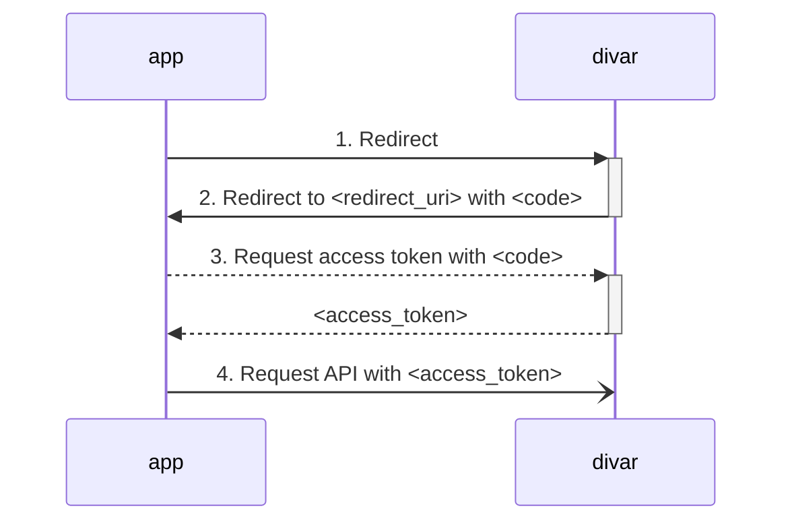

<br><br>

# احراز باز

برخی قابلیت‌های **کنار دیوار**‌ نیازمند اجازه‌ی کاربرها هستند: مثلا [افزودن محتوا به آگهی][راهنما » ساخت افزونه] یا [دریافت اطلاعات کاربر][راهنما » اطلاعات کاربر] نیازمند کسب اجازه از کاربر است. در **کنار دیوار**، فرآیند کسب اجازه از کاربر طبق استاندارد [OAuth 2.0][oauth] انجام می‌شود:


۱. 🖐️ اپلیکیشن کاربر را برای کسب اجازه [به دیوار هدایت (redirect) می‌کند][step 1]. \
۲. ↪️ کاربر، بعد از صدور یا رد اجازه‌های درخواستی، [به آدرس مشخص‌شده توسط اپلیکیشن (redirect URI) هدایت می‌شود][step 2]. \
۳. 🗝️ درصورت صدور اجازه، اپلیکیشن می‌تواند از دیوار [توکنی (access token) برای استفاده از قابلیت‌های مدنظر دریافت ‌کند][step 3]. \
۴. 🔮 اپلیکیشن با استفاده از توکن دریافتی، [از قابلیت‌های مدنظر استفاده می‌کند][step 4]. \
۵. ♻️ در صورت نیاز، اپلیکیشن با استفاده از رفرش توکن دریافتی، [می‌تواند توکن جدید دریافت کند][step 5].


<br><br>



<br><br>

---

🚀 ابزارهای متنوعی برای کار با استاندارد OAuth 2.0 در زبان‌ها و فریم‌ورک‌های مختلف وجود دارد. برخی از این ابزارها را می‌توانید [اینجا ببینید][oauth > tools]. 

---

<br>

## 🖐️ گام اول: درخواست اجازه

برای درخواست اجازه، کاربر را به آدرسی به شکل زیر هدایت (redirect) کنید:

```url
https://api.divar.ir/oauth2/auth?response_type=code
  &client_id=<app-slug>
  &redirect_uri=<redirect-uri>
  &scope=<scopes>
  &state=<state>
```


- *پارامتر `client_id`*: در این پارامتر [شناسه‌ی اپلیکیشن (Slug در پنل کنار)][راهنما » اسلاگ] را قرار دهید.
- *پارامتر `redirect_uri`*: آدرسی از اپلیکیشن که کاربر بعد از صدور (یا رد) اجازه‌های درخواستی به آن هدایت شود.
  - هیچ پارامتری در این آدرس قرار ندهید!
  - مقدار `redirect_uri` حتما باید [URL encode][urlencode] شده باشد.
  - این آدرس باید با یکی از آدرس هایی که در [پنل کنار][پنل کنار] به منظور آدرس‌های مجاز برای هدایت از OAuth تنظیم کرده‌اید مطابقت داشته باشد.
- *پارامتر `scope`*: اجازه‌های مورد نیاز را در این پارامتر لیست  و با اسپیس `" "` از هم جدا کنید. [در مورد اجازه‌ها اینجا را بخوانید][اجازه‌ها].
- *پارامتر `state`*: یک مقدار دلخواه که در بازگشت کاربر به اپلیکیشن شما مجدد در پارامترهای URL قرار می‌گیرد.
  - با استفاده از پارامتر `state` می‌توانید منشاء درخواست بازگشته را احراز نمایید.
  - اگر برای `redirect_uri` نیاز به تنظیم پارامتری دارید، مقادیر این پارامترها را می‌توانید در `state` ذخیره کنید.
  - دقت کنید که حتما `state` شامل مقادیری یکتا و تصادفی باشد تا بتوانید [درخواست‌های بازگشت دروغین][oauth > state] را تشخیص دهید.

<br>

### 🛂 اجازه‌ها (Scope)

قابلیت‌های مختلف، نیازمند کسب اجازه (یا scope)های متفاوت از کاربر هستند. برخی از این اجازه‌ها مربوط به *شیء خاصی* هستند: مثلا برای افزودن محتوا به یک آگهی خاص، می‌بایست اجازه‌ی ساخت افزونه بر روی همان آگهی را از کاربر دریافت کنید. این نوع اجازه‌ها از شکل کلی `SCOPE.IDENTIFIER` تبعیت می‌کنند که در آن:
- قسمت `SCOPE` نمایانگر کلی اجازه‌ی مربوطه (مثلا [اضافه کردن افزونه به آگهی][راهنما » ساخت افزونه]) است.
- قسمت `IDENTIFIER` نمایانگر *شیء خاصیست* که اجازه مربوط به آنست (مثلا شناسه‌ی آگهی).

<br>

> 💡 ***مثال*** \
> برای دریافت اجازه‌ برای اضافه کردن افزونه به آگهی با شناسه‌ی `AZTH74V2`، پارامتر scope را به شکل زیر مقدار دهید. شناسه‌ی آگهی را می‌توانید از پارامتر `post_token` که هنگام [فراخوانی اپلیکیشن][راهنما » مدیریت اپ] ارائه شده است بخوانید.
>
> ```url
> &scope=POST_ADDON_CREATE.AZTH74V2
> ```

<br>

برخی اجازه‌های دیگر مربوط به *شیء خاصی* نیستند و عمومی هستند: برای مثال دریافت شماره‌ی تلفن کاربر (برای یک کاربر خاص) یک اجازه (scope) عمومیست. این نوع اجازه‌ها با شکل `SCOPE` نمایانده می‌شوند.

<br>

>💡 ***مثال*** \
> برای دریافت اجازه‌ی دسترسی به شماره‌ی تلفن کاربر، پارامتر scope را به شکل زیر تنظیم کنید:
> ```url
> &scope=USER_PHONE
> ```

<br>

>💡 ***مثال*** \
> برای دریافت اجازه‌ی دسترسی برای ارسال پیام به کاربر، می‌بایست اطلاعات دریافتی شامل user_id, post_token, peer_id را با اسنفاده از «:» را به هم به چسبانید «user_id:post_token:peer_id» سپس با استفاده از base64 کد کرده و از طریق پارامتر scope به شکل زیر ارسال نمایید:
> 
> ```url
> &scope=CHAT_MESSAGE_SEND.BASE64_CODING_REQUEST_DATA
> ```

<br>

پارامتر scope می‌تواند شامل چند اجازه‌ باشد، که در این صورت باید از فرم کلی `SCOPE_1 SCOPE_2 SCOPE_3 ...` تبعیت کند.

<br>

>💡***مثال*** \
> برای دریافت همزمان اجازه‌ی دسترسی به شماره‌ی کاربر و اجازه‌ی اضافه کردن افزونه به آگهی با شناسه‌ی `AZTH74V2`، پارامتر scope را به شکل زیر مقدار دهید:
> ```url
> &scope=USER_PHONE POST_ADDON_CREATE.AZTH74V2
> ```

<br>

اجازه‌های مورد نیاز هر قابلیت را در صفحه‌ی مربوط به آن قابلیت می‌توانید ببینید. جدول زیر لیستی از اجازه‌های پرکاربرد را نشان می‌دهد.

<div align="right">

| قابلیت | اجازه | مثال |
| - | - | - |
| [ساخت افزونه][راهنما » ساخت افزونه] | POST_ADDON_CREATE | `POST_ADDON_CREATE.AZTH74V2` |
| [ارسال پیام در چت][راهنما » ارسال پیام] | CHAT_MESSAGE_SEND | `CHAT_MESSAGE_SEND.ZTliYThhODEtOTU4M` |
| [دریافت شماره‌ی تلفن کاربر][راهنما » اطلاعات کاربر] | USER_PHONE | `USER_PHONE` |

</div>

<br>

---

🛂 اجازه‌ها مستقل از دسترسی‌های [کلیدهای API][راهنما » کلید] شما هستند. برای استفاده از هر قابلیت می‌باید هم کلیدی با دسترسی‌های لازم استفاده کنید، هم اجازه‌های مورد نیاز را از کاربر دریافت نمایید. برای اطلاعات بیشتر در مورد دسترسی‌ها، [اینجا را بخوانید][راهنما » دسترسی]. 

---

<br>

## ↪️ گام دوم: بازگشت به اپلیکیشن

بعد از اتمام فرآیند کسب اجازه، چه در صورت تایید و چه در صورت رد اجازه‌های درخواستی توسط کاربر، وی به آدرس مشخص‌شده در پارامتر `redirect_uri` در [گام قبل][step 1] هدایت (redirect) می‌شود. برای مثال، اگر مقدار `redirect_uri` در [گام قبل][step 1] به شکل زیر داده شده باشد:

```url
https://api.divar.ir/oauth2/auth?response_type=code
  &cliend_id=...
  &scope=...
  &state=my-random-string
  &redirect_uri=oauth-redirect.my-app.ir
```

بعد از اتمام فرآیند، کاربر به آدرسی به شکل زیر هدایت می‌شود:

```url
https://oauth-redirect.my-app.ir
  ?state=my-random-string
  &code=c87sDtaqmWwgis7dYyukMqy6KAArNUFkukAPW8O90GmiEJkdmSTWH4KjSkNUP6FZ
```

<br>

پارامتر `state` معادل مقدار تنظیم شده توسط اپلیکیشن است. برای آن مقدار تصادفی و یکتایی (برای هر session) تنظیم کنید و هنگام بازگشت این مقدار را چک کنید تا [جلوی سوءاستفاده‌های احتمالی][oauth > state] را بگیرید. 


پارامتر `code` درصورتی تنظیم می‌شود که کاربر اجازه‌های درخواست شده را داده باشد. با این پارامتر، می‌توانید در [گام بعدی][step 3]، اقدام به دریافت توکنی برای فراخوانی قابلیت‌های نیازمند اجازه‌ کنید. اگر اجازه‌های درخواستی برای ادامه‌ی کار با اپلیکیشن شما ضروری هستند، می‌توانید نبود این پارامتر را به منزله‌ی عدم صدور اجازه از جانب کاربر تلقی کرده و خطای مربوطه را نشان دهید.

<br>

## 🗝️ گام سوم: دریافت توکن

در صورت دریافت اجازه از جانب کاربر و دریافت `code`، می‌توانید اقدام به دریافت access token از دیوار نمایید. در این توکن اجازه‌های دریافتی از جانب کاربر ذخیره شده‌اند و با استفاده از آن می‌توانید از قابلیت‌های نیازمند اجازه استفاده کنید.

برای دریافت access token، درخواستی به شکل زیر بفرستید:
```http request
POST https://api.divar.ir/oauth2/token
Content-Type: application/x-www-form-urlencoded

{
  "code": "c87sDtaqmWwgis7dYyukMqy6KAArNUFkukAPW8O90GmiEJkdmSTWH4KjSkNUP6FZ",
  "client_id": "{{app_slug}}",
  "client_secret": "{{client_secret}}",
  "grant_type": "authorization_code",
  "redirect_uri": "{{redirect_uri}}",
}
```
- پارامتر `code`: مقدار دریافتی در [گام قبل][step 2] را قرار دهید.
- پارامتر `client_id`: مانند [گام اول][step 1]، [شناسه‌ی اپلیکیشن (Slug در پنل کنار)][راهنما » اسلاگ] را قرار دهید.
- پارامتر `client_secret`: این پارامتر در زمان ساخت اپ به شما داده می‌شود. به علاوه می‌توانید در صورت نیاز در صفحهٔ مدیریت اپ، کلید محرمانهٔ جدید بسازید.
- پارامتر `redirect_uri`: مقدار این پارامتر برابر با آنچه در [گام اول][step 1] گذاشته شد می‌باشد.

پاسخ به این درخواست‌ها به شکل زیر خواهد بود:
```json
{
    "access_token": "ory_at_mAODvjM21UayVFDtP_KxsCDVwwpb5pwHoNks3vCIeJ8.Gx2sCv2jT4VIbbZDHDIRRwhi45AwV-St1W-gDNdxUUw",
    "expires_in": 3600,
    "scope": "...",
    "token_type": "bearer"
}
```

- پارامتر `access_token`: با استفاده از این پارامتر می‌توانید از قابلیت‌های نیازمند اجازه‌ [استفاده کنید][step 4].
- پارامتر `expires_in`: به ثانیه، نشان میدهد که این توکن تا چه مدت معتبر است.
- پارامتر `scope`: برابر با scopeهای درخواست شده می‌باشد. 


<!--
- پارامتر `refresh_token`: با استفاده از این پارامتر می‌توانید توکن جدیدی قبل از انقضای توکن قبلی دریافت کنید:

```http request
POST https://api.divar.ir/v1/open-platform/oauth/access_token
Content-Type: application/json
x-api-key: {{api_key}}

{
  "refresh_token": "uXvX61ZI0wA7CDqk...",
  "grant_type": "refresh_token"
}
```
-->

<br>

## 🔮 گام چهارم: استفاده از توکن

پس از دریافت توکن با اجازه‌های مورد نیاز، می‌توانید از قابلیت‌های نیازمند این اجازه‌ها استفاده کنید. توکن دریافتی در [گام قبل][step 3] را در هدر `x-access-token` قرار دهید و API مربوط به قابلیت مورد نظر را فراخوانی کنید.

<br>

> 💡***مثال*** \
> برای دریافت شماره‌ی تلفن کاربر، پس از طی مراحل کسب اجازه از کاربر، درخواستی به شکل زیر ارسال نمایید:
> ```http request
> POST https://api.divar.ir/v1/open-platform/users
> Content-Type: application/json
> x-api-key: {{api_key}}
> x-access-token: {{access_token}}
> ```
> پاسخ این درخواست به شکل زیر خواهد بود:
> ```json
> {
>   "phone_numbers": ["09990000000"]
> }
> ```
> دقت کنید که هم کلید API (`api_key`) هم توکن اجازه‌ی کاربر (`access_token`) هر دو برای فراخوانی این قابلیت‌ها لازم‌اند. 


<br>

## ♻️ گام پنجم (اختیاری): دریافت رفرش توکن

در صورتی که در [گام اول][step 1] مقدار `offline_access` در scope به عنوان یکی از اسکوپ‌ها قرار گیرد، در جواب [گام سوم][step 3] یک فیلد اضافه با کلید `refresh_token` نیز برگردانده می‌شود. اعتبار این توکن ۳۰ روز می‌باشد و بعد از آن، نیازمند گرفتن دسترسی مجدد از کاربر هستید. با استفاده از این مقدار می‌توانید اکسس توکن خود را با استفاده از درخواست زیر تازه‌سازی کنید:
```http request
POST https://api.divar.ir/oauth2/token
Content-Type: application/x-www-form-urlencoded

{
  "code": "{{current_access_token}}",
  "client_id": "{{app_slug}}",
  "client_secret": "{{client_secret}}",
  "grant_type": "refresh_token",
  "redirect_uri": "{{redirect_uri}}",
  "refresh_token": "{{refresh_token}}"
}
```
- پارامتر `code`: اکسس توکنی که در اختیار دارید.
- پارامتر `client_id`: مانند [گام اول][step 1]، [شناسه‌ی اپلیکیشن (Slug در پنل کنار)][راهنما » اسلاگ] را قرار دهید.
- پارامتر `client_secret`: می‌توانید در صفحهٔ مدیریت اپ، کلید محرمانهٔ جدید بسازید.
- پارامتر `redirect_uri`: مقداری که در [گام سوم][step 3] برای گرفتن توکن قرار داده شده.
- پارامتر `refresh_token`: `refresh_token`ای که در [گام سوم][step 3] دریافت کردید.

پاسخ به این درخواست‌ها به شکل زیر خواهد بود:
```json
{
    "access_token": "ory_at_vV8nGHSkMumIEqojmUrq4Jdc8ZyifoNsdcUuMS2xr8s.P_1q_7d-xxHSAHuXUyB8YtLH4puqQA4hhO-TZGcpCtA",
    "expires_in": 3600,
    "refresh_token": "ory_rt_R9MRLXX9vY_AHmzvxTNrw80MdkgQ9xIC9WVbYDBvuyE.LpFjcEWK34WnI5DMj6CTObMFhvQ8N663ji3qj910M14",
    "scope": "...",
    "token_type": "bearer"
}
```


[راهنما » ساخت افزونه]: /addons/approved_addon.md
[راهنما » اطلاعات کاربر]: /oauth/get_user.md
[پنل کنار]: https://divar.ir/kenar
[oauth]: https://oauth.net/2/
[oauth > tools]: https://oauth.net/code/
[راهنما » ساخت اپ]: /management/ReadMe.md.md
[راهنما » کلید]: /management/api-keys.md
[step 1]: /oauth/ReadMe.md#%EF%B8%8F-گام-اول-درخواست-اجازه
[step 2]: /oauth/ReadMe.md#%EF%B8%8F-گام-دوم-بازگشت-به-اپلیکیشن
[step 3]: /oauth/ReadMe.md#%EF%B8%8F-گام-سوم-دریافت-توکن 
[step 4]: /oauth/ReadMe.md#-گام-چهارم-استفاده-از-توکن
[step 5]: /oauth/ReadMe.md#%EF%B8%8F-گام-پنجم-اختیاری-دریافت-رفرش-توکن
[راهنما » اسلاگ]: /management#slug
[urlencode]: https://www.w3schools.com/tags/ref_urlencode.ASP
[اجازه‌ها]: /oauth/ReadMe.md#-اجازهها-scope
[oauth > state]: https://stackoverflow.com/questions/26132066/what-is-the-purpose-of-the-state-parameter-in-oauth-authorization-request
[راهنما » مدیریت اپ]: /management
[base64]: https://developer.mozilla.org/en-US/docs/Glossary/Base64
[راهنما » ارسال پیام]: /chat/send_message.md
[راهنما » دسترسی]: /management/api-keys.md#دسترسیهای-پرکاربرد
[unix time]: https://en.wikipedia.org/wiki/Unix_time 


<br><br>

<div align="center">


</div>

<br><br>
