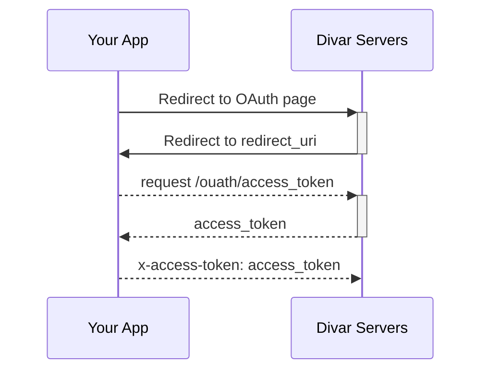

# احراز باز (OAuth)

برای درخواست اطلاعات یا دسترسی از کاربران دیوار استاندارد [OAuth 2.0](https://oauth.net/2/) ارائه می‌شود. کتابخانه‌های مرتبط برای استفاده از OAuth را [اینجا](https://oauth.net/code/) می‌توانید ببینید.

## مراحل فرایند OAuth

### ارسال کاربر به صفحهٔ درخواست اجازه‌

در این استاندارد شروع فرایند از سایت یا اپلیکیشن خارجی(غیر دیوار) است.
ابتدا سایت شما کاربر را به سایت دیوار برای دریافت اجازه ریدایرکت میکند. URL صفحه‌ای که کاربر را به آن هدایت می‌کنید : شده باید به صورت زیر باشد:

```
https://open-platform-redirect.divar.ir/oauth?response_type=code&client_id=your-client-id&redirect_uri=your-redirect-url&scope=ADDON_USER_APPROVED__AZTH74V2+USER_PHONE&state=some-random-state
```
**توضیحات پارامترها**

<table dir="rtl">
<thead>
<tr>
<td><strong>پارامتر<strong></td>
<td><strong>توضیحات و کارکرد</strong></td>
</tr>
</thead>
<tr>
<td><code>response_type</code></td>
<td>نوع ارائهٔ مجوز به سایت</td>
</tr>
<tr>
<td><code>client_id</code></td>
<td>مقدار app slug شما در پنل کنار دیوار</td>
</tr>
<tr>
<td><code>redirect_uri</code></td>
<td>آدرس مورد نظر شما برای هدایت کاربر بعد از پاسخ به درخواست دسترسی‌ها، این URL نباید شامل هیچ پارامتری باشد</td>
</tr>
<tr>
<td><code>scope</code></td>
<td>مجوز هایی که از کاربر می خواهید دریافت کنید که با استفاده از <code>+</code> جدا شده اند. <a href="#توضیحات-scope">توضیحات scope</a></td>
<tr>
<td><code>state</code></td>
<td>طبق استاندارد oauth یک رشته رندوم که هنگام بازگشت کاربر به redirect_uri به عنوان یک پارامتر پاس داده می‌شود. هدف این پارامتر اطمینان از شروع فرایند از سایت خود شماست که می توانید این موضوع را با نگه داشتن state در session نیز حل کنید.</td>
</tr>
</table>


> میتوانید از `state` برای نگهداری پارامترهای دلخواه خود که امکان نگهداری آنها را در `redirect_uri` نداشتید استفاده کنید. توجه کنید که در ساختار داده خود همچنان پارامتر رندوم را قرار دهید تا سایت شما مورد حمله قرار نگیرد.

#### توضیحات scope

در این قسمت می‌توانید درخواست دو نوع مجوز بدهید:

- **مجوز روی منابع (مثل یک چت یا یک آگهی):‌**

  این نوع مجوز ها روی منابع مشخص هستند که باید `id` منبع مورد نظر را داشته باشید.
  
  به این شکل که `id` منبع مورد نظر (مثلاً چت یا آگهی) را با `__` در کنار نام دسترسی‌ درخواستی در مقدار scope قرار می‌دهیم. و اگر این دسترسی برای چند مورد متفاوت است با `+` می‌توانند در کنار هم قرار بگیرند.
  

```
(PERMISSION_SCOPE)__(RESOURCE_ID)
```
  مثال:
  
  `ADDON_USER_APPROVED__AZTH74V2`

> این نوع مجوز‌ها بدون `id` کار نمی‌کنند.

- **مجوز عمومی:**


  این نوع مجوزها نیازی به ارائهٔ `id` ندارند. مثلاً درخواست دسترسی به شمارهٔ همراه متصل به حساب کاربر. که کافیست نام دسترسی مورد نظر (`USER_PHONE`) را در مقدار scope قرار بدهید.


## بازگشت کاربر از صفحهٔ درخواست دسترسی

بعد از پاسخ کاربر به درخواست دسترسی‌ها، دیوار کاربر را به URL موجود در پارامتر `redirect_uri` هدایت می‌کند و تعدادی پارامتر هم به آن آدرس اضافه می‌کند که در ادامه توضیح داده‌می‌شود.

مثال از آدرسی که کاربر به آن هدایت می‌شود:

```
($redirect_uri)?state=some-random-state&code=c87sDtaqmWwgis7dYyukMqy6KAArNUFkukAPW8O90GmiEJkdmSTWH4KjSkNUP6FZ
```

**توضیحات پارامتر ها**

<table dir="rtl">
<thead>
<tr>
<td><strong>پارامتر<strong></td>
<td><strong>توضیحات و کارکرد</strong></td>
</tr>
</thead>
<tr>
<td><code>code</code></td>
<td>در صورتی که کاربر اجازهٔ دسترسی‌های مورد نظر شما را در صفحهٔ درخواست، داده‌باشد، این پارامتر به آدرس صفحهٔ بازگشت اضافه خواهد شد. بنابراین در صورت نبودن این پارامتر می‌توانید پیام خطای لازم را در صفحهٔ خود نمایش دهید.</td>
</tr>
<tr>
<td><code>state</code></td>
<td>مقدار این پارامتر دقیقاً همان مقداری خواهد بود که به عنوان پارامتر state در <a href="#ارسال-کاربر-به-صفحهٔ-درخواست-اجازه">آدرس صفحهٔ درخواست</a> قرار داده‌اید.</td>
</tr>
<tr>
</table>


## دریافت access token

در مرحلهٔ آخر با داشتن `code`، `api-key` و `app-slug` می‌توانید درخواست `access-token` بدهید و با استفاده از آن از مجوزهایی که کاربر به شما داده، استفاده کنید.

نمونهٔ درخواست برای دریافت `access-token`

```http request
POST https://api.divar.ir/v1/open-platform/oauth/access_token
Content-Type: application/json
x-api-key: {{apikey}}

{
  "code": "c87sDtaqmWwgis7dYyukMqy6KAArNUFkukAPW8O90GmiEJkdmSTWH4KjSkNUP6FZ",
  "client_id": "{{app_slug}}",
  "client_secret": "{{oauth_key}}",
  "grant_type": "authorization_code",
}
```

نمونه پاسخ

```JSON
{
  access_token: "f2mjqwiYDigBwGYg2baN8toU9fHxqyKTZKFZkAsLTeNXKObOtsdL0B9vobNZ3SrTc9IhNS2rrG4Guuk9hxZLe0iqgoMbS2W7Jd3jaDUsrVM33teFWsISCrhdj88u99jb",
  refresh_token: "uXvX61ZI0wA7CDqkkMfGUXQ3VDO0WVDN9nieQ3qWpXAWU6oliDgXVn5d7pep1nAebMsyZmTa7AWBklTEOvrPPmsEaEobnp0tvJKrqaLdTAPwpSEZn9k5xLF4Acdxl18Zk9XJubGIJefbXOdyjJX7i4D4imr4VTJO7W4fASyOAyKgfBceBAnDTP4cKwC9dW9646NUTJKbFdNKtKCOsRQeVFAatfvyBX1lRkDo3j1McbD1a1uQmQWC9futrvSo6T8U",
  expires: "1692457372",
}
```

### توضیحات مقادیر ارسالی در درخواست access-token

<table dir="rtl">
<thead>
<tr>
<td><strong>پارامتر<strong></td>
<td><strong>توضیحات و کارکرد</strong></td>
</tr>
</thead>
<tr>
<td><code>code</code></td>
<td>مقدار پارامتر `code` که در آدرس صفحهٔ بازگشت قرار داده‌شد.</td>
</tr>
<tr>
<td><code>client_id</code></td>
<td>مقدار app slug شما در پنل کنار دیوار</td>
</tr>
<tr>
<td><code>client_secret</code></td>
<td>برای این قسمت مقدار <code>api-key</code> که از پنل کنار دیوار دریافت کرده‌اید را وارد کنید.</td>
</tr>
</table>

### توضیح پاسخ دریافتی

- مقدار `access_token` کلید مورد نیاز برای دسترسی به منابع درخواستی از کاربر است که اجازه دسترسیشان را گرفتید.
- مقدار `expires` برابر با مقدار زمان به فرمت [unix](https://en.wikipedia.org/wiki/Unix_time) است و زمان انقضای کلید دریافتی است.


حال با استفاده از `access-token` و قراردادن آن در هدر `x-access-token` و همچنین پر کردن هدر `x-api-token` با `api-key` که از پنل کنار دیوار دریافت کرده‌اید، می‌توانید درخواست‌هایی که نیازمند اجازهٔ کاربر هستند را نیز بفرستید.

