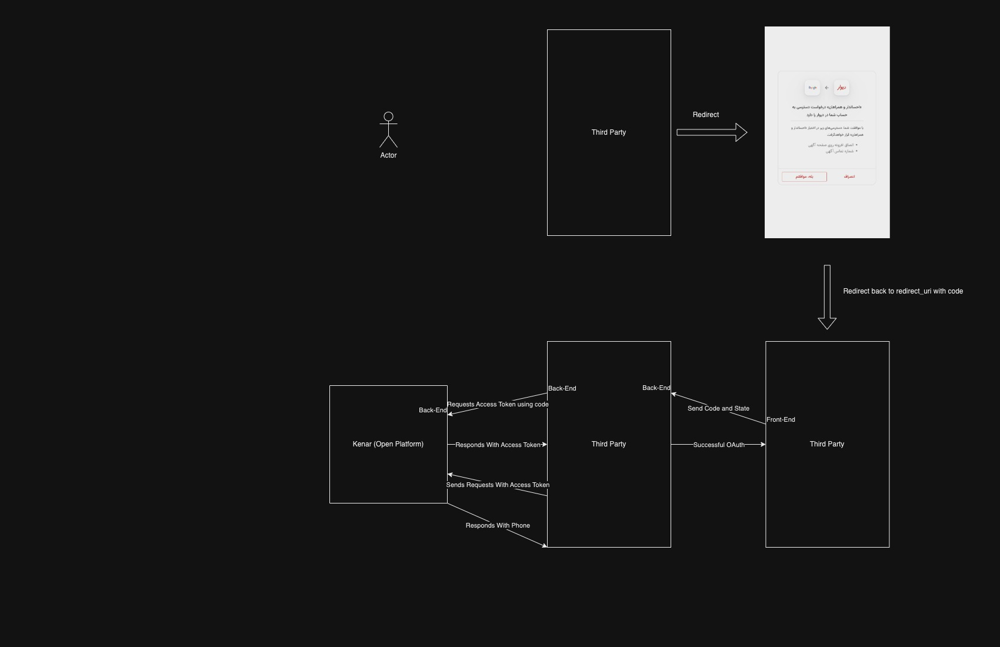

# احراز باز (OAuth)
برای دریافت اطلاعات حساس کاربران دیوار ما از استاندارد OAuth 2.0 استفاده میکنیم.
### شروع پروسه (redirect)
در این استاندارد شروع پروسه از سایت یا اپلیکیشن خارجی(غیر دیوار) می باشد. در ابتدا سایت شما کاربر را به سایت دیوار
برای دریافت اجازه redirect می کند. url ریدایرکت شده باید به صورت زیر باشد 
```http request
GET https://open-platform-redirect.divar.ir/oauth?response_type=code&client_id=your-client-id&redirect_uri=your-redirect-url&scope=ADDON_USER_APPROVED__AZTH74V2+USER_PHONE&state=some-random-state
```

#### توضیحات پارامتر ها
- پارامتر ‍`response_type`: نحوه دادن مجوز به سایت خارجی
- پارامتر `client_id`: اپ اسلاگ یا app slug در پنل کنار
- پارامتر `redirect_uri`: لینکی که بعد از گرفتن مجوز کاربر باید به آن برگردد.طبق استاندارد این uri نباید شامل هیچ پارامتری باشد.
- پارامتر ‍`scope`: منابع یا مجوز هایی که از کاربر می خواهید که با استفاده از `+` جدا شده اند.
- پارامتر `state`: طبق استاندارد oauth یک رشته رندوم که هنگام برگشت کاربر به redirect_uri به عنوان یه پارامتر پاس داده میشود هدف این پارامتر صحت سنجی برای سایت خارجی(third party) از این باشد که پروسه را خودش شروع کرده. می توانید این موضوع را با نگه داشتن state در session حل کنید.

#### توضیحات scope
دو نوع مجوز وجود دارد:
- مجوز روی منابع:‌
  این نوع مجوز ها روی منابع خاص هستند شما باید یک `id` از منبع مورد نظر داشته باشید. به طور مثال برای `ADDON_USER_APPROVED` که افزونه تایید  شده کاربر می باشد، شما باید توکن اگهی که برای کاربر است را به همراه آن بفرستیم
به طور مثال اگر توکن اگهی ‍‍`AZTH74V2` باشد مجوز می شود`ADDON_USER_APPROVED__AZTH74V2`(با `__` جدا کنید به شکل زیر)
```
(PERMISSION_SCOPE)__(RESOURCE_ID)
```
**نکته**:‌ مجوز هایی که نیاز به منبع دارند بدون `id` کار نمیکنند!  
- مجوز بدون منابع:
  این نوع مجوز ها نیاز به `id` ندارند به طور مثال `USER_PHONE` که مجوزه شماره همراه کاربر را میدهد.

### بازگشت کاربر به redirect_uri
بعد از گرفتن اجازه از کاربر دیوار کاربر را به redirect_uri به همراه تعداد پارامتر برمیگرداند. به طور مثال:
```
($redirect_uri)?state=some-random-state&code=c87sDtaqmWwgis7dYyukMqy6KAArNUFkukAPW8O90GmiEJkdmSTWH4KjSkNUP6FZ
```

#### توضیحات پارامتر ها
- پارامتر `code`: این پارامتر در صورتی داده می شود که کاربر مجوز ها درخواست شده را تایید کند و در صورت عدم تایید کاربر این پارامتر برگردانده نمی شود.
- پارامتر `state`: همانطور که پیش تر توضیح داده شد همان پارامتری است که هنگام شروع داده می شود تا مطمئن شوید خودتان پروسه را شروع کردید.

### گرفتن access token
برای استفاده از مجوز هایی که کاربر بهتان میدهد به یک کلید نیاز دارید برای دریافت این کلید باید از رکوئست زیر استفاده کنید.
```http request
POST https://api.divar.ir/v1/open-platform/oauth/access_token
Content-Type: application/json
x-api-key: {{apikey}}

{
  "code": "c87sDtaqmWwgis7dYyukMqy6KAArNUFkukAPW8O90GmiEJkdmSTWH4KjSkNUP6FZ",
  "client_id": "{{app_slug}}",
  "client_secret": "{{oauth_key}}",
  "grant_type": "authorization_code",
}
```
نمونه پاسخ
```json5
{
  "access_token":"f2mjqwiYDigBwGYg2baN8toU9fHxqyKTZKFZkAsLTeNXKObOtsdL0B9vobNZ3SrTc9IhNS2rrG4Guuk9hxZLe0iqgoMbS2W7Jd3jaDUsrVM33teFWsISCrhdj88u99jb",
  "refresh_token":"uXvX61ZI0wA7CDqkkMfGUXQ3VDO0WVDN9nieQ3qWpXAWU6oliDgXVn5d7pep1nAebMsyZmTa7AWBklTEOvrPPmsEaEobnp0tvJKrqaLdTAPwpSEZn9k5xLF4Acdxl18Zk9XJubGIJefbXOdyjJX7i4D4imr4VTJO7W4fASyOAyKgfBceBAnDTP4cKwC9dW9646NUTJKbFdNKtKCOsRQeVFAatfvyBX1lRkDo3j1McbD1a1uQmQWC9futrvSo6T8U",
  "expires":"1692457372"
}
```
### توضیح رکوئست
- مقدار `code` باید برابر با همان پارامتر `code` ای باشد که کاربر پس از بازگشت از دیوار به همراه خود دارد
- مقدار `client_id` همان `app_slug` است که در پنل کنار تعریف شده است.
- مقدار `client_secret` برابر با `api-key` است که در پنل کنار  OAuth Enabled آن Yes باشد.
- مقدار `grant_type` باید `authorization_code` باشد زیرا در حال حاضر کنار فقط از این نوع OAuth پشتیبانی می کند.
- مقدار `access_token` کلید مورد نیاز برای دسترسی به منابع با مجوز داده شده ی کاربر میباشد.
- مقدار `expires` برابر با مقدار زمان به فرمت [unix](https://en.wikipedia.org/wiki/Unix_time) است.

حال با استفاده از access token و قرار دادن آن در هدر `x-access-token` می توانید به api های مربوط به OAuth که مجوز آن را دارید رکوئست بزنید. 


**نکته**: قرار دادن `x-api-token` با مجوز های مربوطه نیز اجباری است یعنی داشتن `access_token` به تنهایی کافی نیست.


