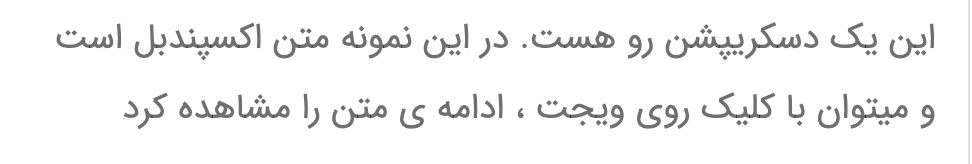
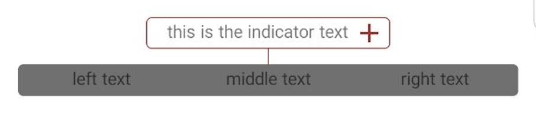
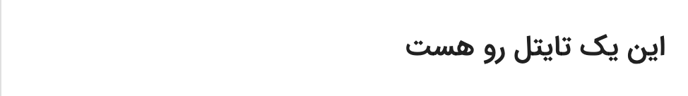
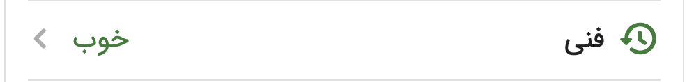

# ساختار ویجت های دیوار (Widgets)
ویجت‌ها اجزای تشکیل دهندهٔ صفحات در دیوار هستند، که برخی از آنها را می‌توانید در افزونه‌های خود استفاده کنید.
برای درج یک ویجت در یک افزونه باید نام ویجت و جزییات مرتبط با آن را همراه درخواست درج افزونه ارسال کنید.

به عنوان مثال ، در ریکوئست ساخت اند آن میتواند این اطلاعات وجود داشته باشد:

مثال:
```JSON
{
    "widgets": [
        {
            "description_row": {
                "text": "این یک دسکریپشن رو هست",
                "has_divider": false,
                "expandable": false,
            }
            "semantic_paths": {
              "a sample sentence": "text"
            }
        },
        {
          "event_row": {
            "title": "یه تایتل مناسب",
            "subtitle": "یه زیر تایتل مناسب تر",
            "label": "یه لیبل زیبا",
            "image_id": "someuuid.jpg",
            "has_divider": true,
            "icon_name": "ADD"
            "action": {
              "open_direct_link": "https://google.com"
            }
          },
          "semantic_paths": {
            "user_face": "image_id"
          }
        }

    ]
}
```

اطلاعاتی که درون `widgets` قرار دارد ، لیستی از ویجت ها و ساختار داده‌هایی است که دیوار برای نمایش اطلاعات پشتیبانی می‌کنند.
هر ویجت ویژگی‌های خود را دارد که در ابجکتی در فیلدی با مقدار نام خودش  می‌توان تعیینشان کرد. مثلاً با `true` گذاشتن مثدار `divider` برای ویجت‌هایی که این ویژگی را دارند، می‌توان یک خط جدا کننده زیر ویجت نمایش داد.

ساختار کلی هر ویجت:

```json5
{
    "widget_name_in_snake_case": { // this is referred to as widget data
        // fields
    },
    "semantic_paths": {
        "key for an information you want to relay": "path to the field from the widget data object"
    }
}
```
#### اطلاعات معنایی ویجتی
شما می‌توانید با استفاده از فیلد `semantic_paths` واقع کنار دیتای ویجت اطلاعاتی معنایی درباره فیلد های داخلی ویجت بدهید.
در فیلد `semantic_paths` یک `object` جیسون وجود دارد که تمام value هایش `string` است.
در value یک [fieldmask_path](https://github.com/protocolbuffers/protobuf/blob/main/src/google/protobuf/field_mask.proto) قرار میگیرد که همانند jsonpath می‌باشد ولی از اندیس آرایه نمی‌توان استفاده کرد.
مسیر از داخل دیتای ویجت شروع میشود به طور مثال اگر داشته باشیم:
```json
{
      {
          "event_row": {
            "title": "یه تایتل مناسب",
            "subtitle": "یه زیر تایتل مناسب تر",
            "label": "یه لیبل زیبا",
            "image_id": "someuuid.jpg",
            "has_divider": true,
            "icon_name": "ADD"
            "action": {
              "open_direct_link": "https://google.com"
            }
          },
          "semantic_paths": {
            "user_face": "image_id",
            "my_link": "action.open_direct_link"
          }
        }
}
```
که دیوار نتیجه اطلاعات معنایی زیر را دارد:
```json
{
    "user_face": "someuuid.jpg",
    "my_link": "https://google.com"
}
```
از این اطلاعات می‌توان برای ارتباط با تیم های دیواری استفاده کنید.

ویژگی‌های هر ویجت، شرایط اعتبار سنجی و توضیحات مرتبط هر کدام در صفحات زیر دسترس‌ است.
# لیست ویجت های کنار دیوار
- [DESCRIPTION_ROW](./description_row.md)


- [EVALUATION_ROW](./evaluation_row.md)

- [TITLE_ROW](./title_row.md)

- [SUBTITLE_ROW](./subtitle_row.md)

- [BUTTON_BAR](./button_bar.md)

- [SELECTOR_ROW](./selector_row.md)

- [EVENT_ROW](./event_row.md)

- [GROUP_INFO_ROW](./group_info_row.md)

- [SCORE_ROW](./score_row.md)


- [IMAGE_CAROUSEL_ROW](./score_row.md)

### ویجت‌های دارای تصویر
برای اطلاع از درج تصویر در ویجت‌هایی که امکان نمایش تصویر در قسمتی از خود را دارند، [صفحهٔ تصاویر در ویجت‌ها](./image.md) را ببینید

### اکشن‌ها
اکشن‌های قابل استفاده در پلتفرم کنار دیوار در
[قسمت اکشن‌ها](./actions/ReadMe.md)
توضیح داده شده است.

### فایل فیگمای ویجت‌ها و آیکون‌ها

- [فیگمای آیکون‌ها و رنگ‌ها و ویجت‌های دیوار](https://www.figma.com/file/ZhhSihwKTjiER1VUDX4ovh/%F0%9F%93%92-Kenar-Docs-(WIP)?type=design&node-id=2-4&mode=design&t=RbiQ2ay29ombNJKz-11)
