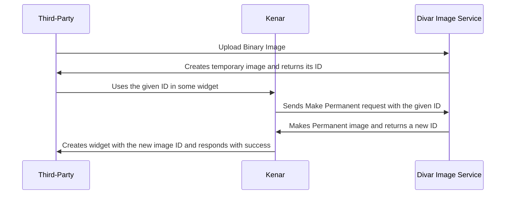

# عکس در ویجت ها

تعدادی از ویجت ها از عکس پشتیبانی می‌کنند. برای قرار دادن عکس در این ویجت ها باید ابتدا آن‌ها اپلود کنید.  فلوی ثبت عکس در ویجت به صورت زیر می باشد.

```mermaid
sequenceDiagram
    participant Third-Party
    participant Kenar
    participant Divar Image Service
    Third-Party->>Divar Image Service: Upload Binary Image
    Divar Image Service->>Third-Party: Creates temporary image and returns its ID
    Third-Party->>Kenar: Uses the given ID in some widget
    Kenar->>Divar Image Service: Sends Make Permanent request with the given ID
    Divar Image Service->>Kenar: Makes Permanent image and returns a new ID
    Kenar->>Third-Party: Creates widget with the new image ID and responds with success
```
