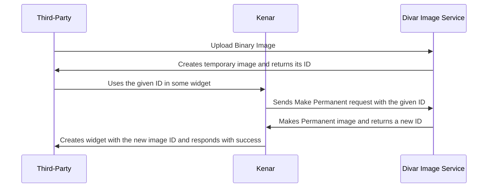

# عکس در ویجت ها

تعدادی از ویجت ها از عکس پشتیبانی می‌کنند. برای قرار دادن عکس در این ویجت ها باید ابتدا آن‌ها اپلود کنید. فلوی ثبت عکس در ویجت به صورت زیر می باشد.



### اپلود عکس

در ابتدا با یک رکوئست PUT باینری عکس خود را به صورت زیر اپلود کنید.

```http request
PUT /v2/image-service/open-platform/image.jpg HTTP/1.1
Host: divar.ir
Content-Type: image/jpeg
Content-Length: 22

"<file contents here>"
```
دفت شود که`image.jpg` انتهای url یک نام ثابت است و ربطی به نام عکس اپلودی ندارد!(در تمام رکوئست ها `image.jpg` بگذارید)

پس از ارسال رکوئست پاسخ زیر دریافت می‌شود.

```json5
{
    "image_name": "57c76b48-d381-4b8a-b34f-355f6869b6ed.jpg"
}
```

### ساخت افزونه

حال در رکوئست ساخت افزونه از id عکس دریافت شده استفاده میکنیم.


```http request
POST //v1/open-platform/add-ons/post/AZqfx5i2 HTTP/1.1
Host: api.divar.ir
X-Debug-Token: JNbtiaMZ
Content-Type: application/json
x-api-key: 9Hh7JDAYLwuAtM9Y5A1hc3WSfBM4-_QfZ5R2HZTdArhN-fa8uLAtIn699zfNR_kxd9Qnnvf-id3W_a2QlwrrIVyBigaQQfiSjNGQCu1oKge-gg4fboPIksgkbZpslbsFz-jGVL2GE-hLp2wTbxitzKr_McZ2RWYDYPmsBk2ol3b_O9k2PCz8V-X5hN0U9GsmRBfaiUDp7bK1KSWZA-KiRYkIPt3_jiTJ6AeX-Xp8vGkdEW4yfx0eZOPDIve6a3ND
Content-Length: 901

{
    "widgets": {
        "widget_list": [
            {
                "widget_type": "LEGEND_TITLE_ROW",
                "data": {
                    "@type": "type.googleapis.com/widgets.LegendTitleRowData",
                    "title": "افزونه تستی",
                    "subtitle": "کارشناسی تستی",
                    "has_divider": true,
                    "image_url": "logo"
                }
            },
             {
                "widget_type": "EVENT_ROW",
                "data": {
                    "@type": "type.googleapis.com/widgets.EventRowData",
                    "title": "یک اونت رو",
                    "subtitle": "اطلاعات بیشتر اونت رو",
                    "has_divider": true,
                    "image_url": "57c76b48-d381-4b8a-b34f-355f6869b6ed.jpg"
                }
            }
        ]
    }
}
```

همانطور که مشاهده می کنید در ویجت `EVENT_ROW` عکسمان رو قرار داده ایم.

در ویجت های عکس دار هم همانند `Legend Title Row` می‌توانید از `logo` برای استفاده از لوگو اپتون تو کنار استفاده کنید.

### ویجت های عکس دار
- [EVENT_ROW](./event_row.md)
- [IMAGE_CAROUSEL_ROW](./image_carousel_row.md)

در صورتی که هنگام ساخت افزونه پیام `one or more widgets not allowed` رو دریافت می‌کنید به این منظور است که شما دسترسی ساخت یک نوع ویجت از ویجت هایی که در درخواستتان هست را ندارید برای دریافت دسترسی با پشتیبانی در ارتباط باشید.

