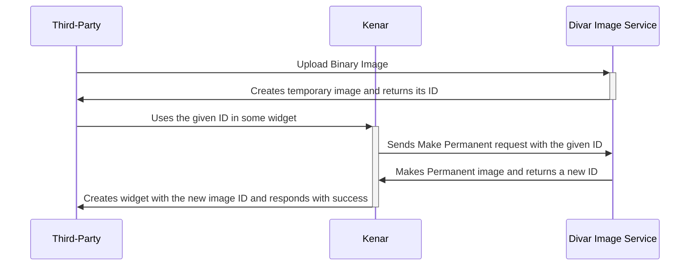

# درج تصویر در ویجت‌ها

تعدادی از ویجت‌های دیوار امکان نمایش تصویر در قسمتی از خود را دارند. برای اضافه کردن تصویر به ویجت مورد نظر ابتدا باید تصویر را آپلود کنید و سپس شناسهٔ آت را در مشخصات ویجت قرار دهید.



### آپلود تصویر

در ابتدا با یک رکوئست PUT باینری فایل تصویر خود را به صورت زیر آپلود کنید. (ترجیحا فرمت عکس ها jpeg باشد)

```http request
PUT /v2/image-service/open-platform/image.jpg HTTP/1.1
Host: divar.ir
Content-Type: image/jpeg
Content-Length: 22

"<file contents here>"
```

دفت شود که`image.jpg` انتهای url یک نام ثابت است و ربطی به نام عکس آپلودشده ندارد! (در تمام رکوئست ها `image.jpg` بگذارید)

پس از ارسال درخواست، چنین پاسخی دریافت می‌شود.

```json5
{
  image_name: "57c76b48-d381-4b8a-b34f-355f6869b6ed.jpg",
}
```

### درج تصویر در افزونه

حال در محل مورد نظرتان برای درج تصویر، `id` دریافتی از درخواست قبلی را قرار دهید.

برای مثال در نمونه درخواست زیر در ویجت `EVENT_ROW` تصویر مورد نظرمان را قرار دادیم.

```http request
POST //v1/open-platform/add-ons/post/AZqfx5i2 HTTP/1.1
Host: api.divar.ir
X-Debug-Token: JNbtiaMZ
Content-Type: application/json
x-api-key: 9Hh7JDAYLwuAtM9Y5A1hc3WSfBM4-_QfZ5R2HZTdArhN-fa8uLAtIn699zfNR_kxd9Qnnvf-id3W_a2QlwrrIVyBigaQQfiSjNGQCu1oKge-gg4fboPIksgkbZpslbsFz-jGVL2GE-hLp2wTbxitzKr_McZ2RWYDYPmsBk2ol3b_O9k2PCz8V-X5hN0U9GsmRBfaiUDp7bK1KSWZA-KiRYkIPt3_jiTJ6AeX-Xp8vGkdEW4yfx0eZOPDIve6a3ND
Content-Length: 901

{
    "widgets": {
        "widget_list": [
            {
                "widget_type": "LEGEND_TITLE_ROW",
                "data": {
                    "@type": "type.googleapis.com/widgets.LegendTitleRowData",
                    "title": "افزونه تستی",
                    "subtitle": "کارشناسی تستی",
                    "has_divider": true,
                    "image_url": "logo"
                }
            },
             {
                "widget_type": "EVENT_ROW",
                "data": {
                    "@type": "type.googleapis.com/widgets.EventRowData",
                    "title": "یک اونت رو",
                    "subtitle": "اطلاعات بیشتر اونت رو",
                    "has_divider": true,
                    "image_url": "57c76b48-d381-4b8a-b34f-355f6869b6ed.jpg"
                }
            }
        ]
    }
}
```

علاوه بر درج تصویر دلخواه می‌توان به جای `{id}` مقدار `logo` را به عنوان `image_url` فرستاد تا لوگوی اپ شما که در پنل کنار دیوار قابل تنظیم است، در ویجت درج شود.
### ویجت های عکس دار
<ul dir="rtl">
<li><a href="event_row.md">EVENT_ROW</a></li>
<li><a href="image_carousel_row.md">IMAGE_CAROUSEL_ROW</a></li>
<li><a href="legend_title_row.md">LEGEND_TITLE_ROW</a> این ویجت فقط از مقدار <code>logo</code> برای تصویر پشتیبانی می‌کند و امکان درج تصویر آپلودشده را در آن ندارید.</li>
<ul>